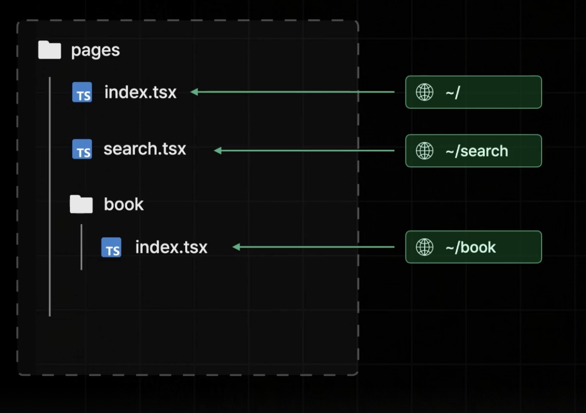
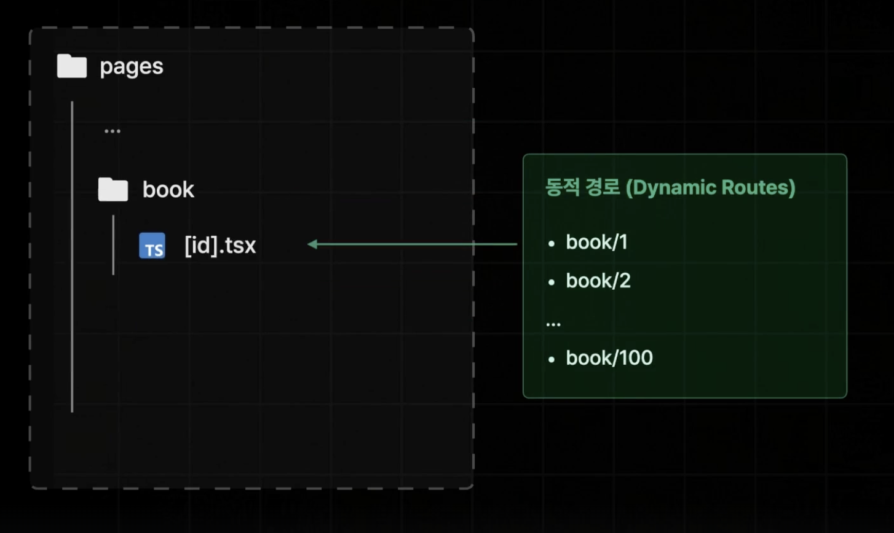
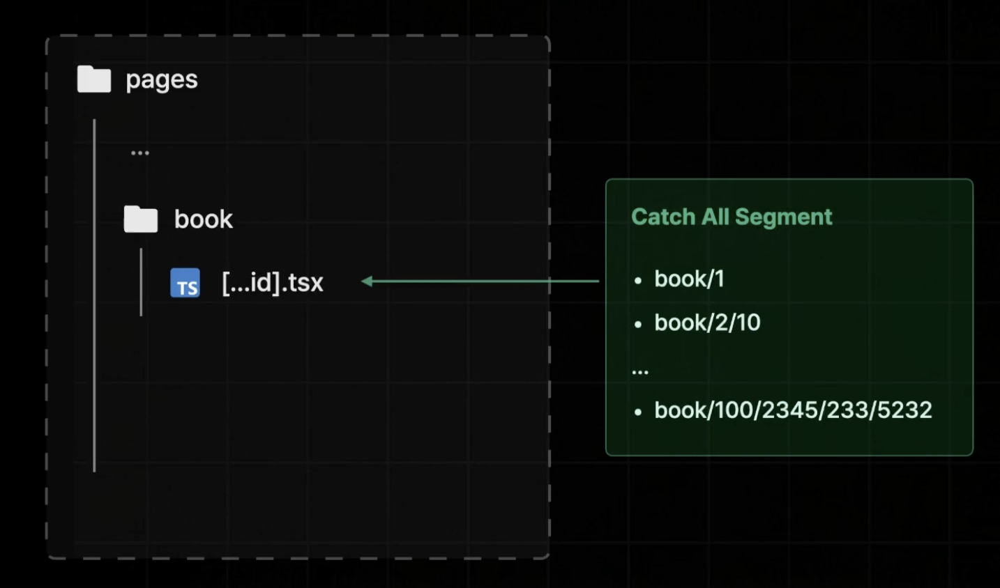
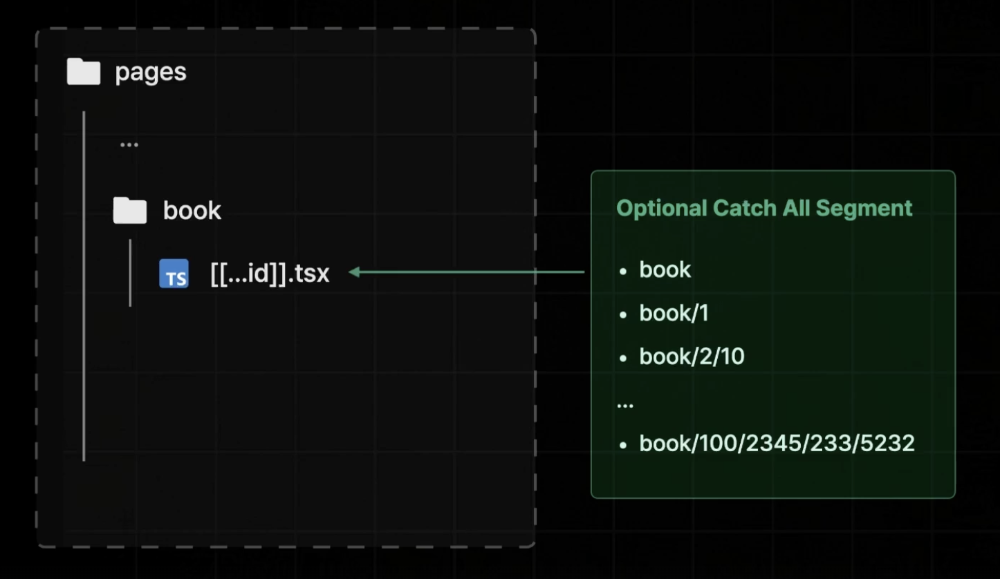
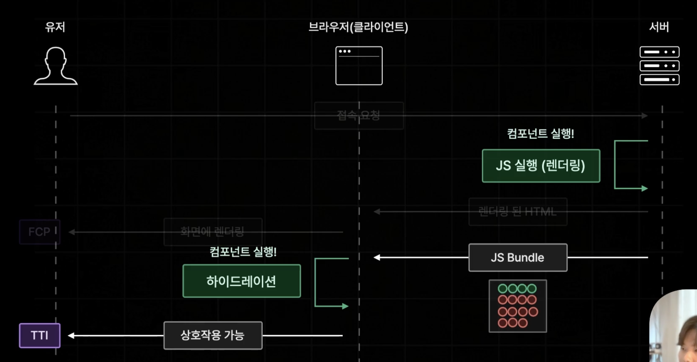
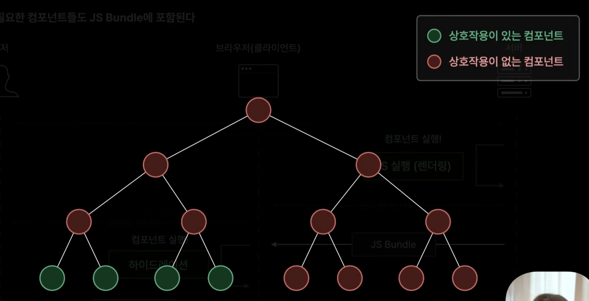
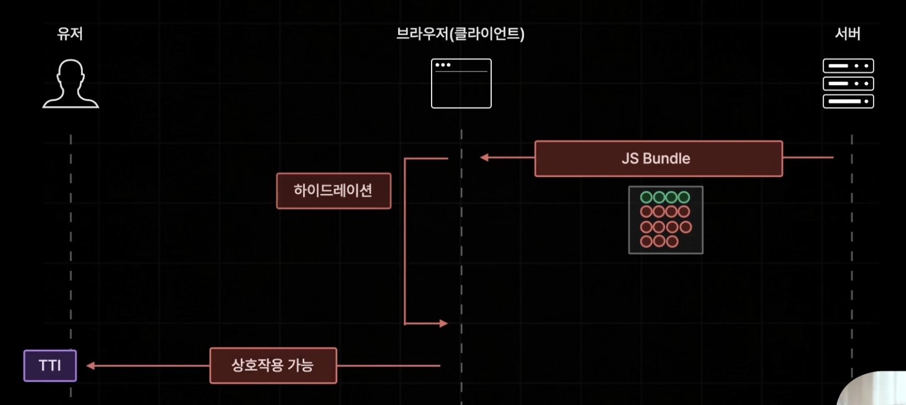

## Page Router의 장점

1. 파일 시스템 기반 간편한 페이지 라우팅 제공

   

   

   

   

2. 다양한 방식의 사전 렌더링 제공

   1. SSR : 사용자 요청 시 정적 페이지를 생성해서 제공하여 FCP를 단축
   2. SSG : 빌드 타임에 미리 생성된 정적 페이지를 제공
   3. ISR : 일정 주기, 요청에 따라 정적 페이지를 새로 생성

## Page Router의 단점

- 페이지별 레이아웃이 생각보다 번거롭고 복잡하다.

  -> App Router에서는 파일 하나로 전체 레이아웃을 대체

- 데이터 패칭이 페이지 컴포넌트에 집중된다. 만약, 자식 컴포넌트들에게 이 데이터들을 전달해줘야 한다면 Props Drilling이 발생한다. 이를 해결하기 위해 ContextAPI나 Recoil같은 전역상태 라이브러리를 사용할 수는 있지만 이 구조자체가 불필요하게 느껴진다.

- 불필요한 컴포넌트들도 JS Bundle에 포함된다. JS Bundle을 받아서 Hydration과정을 거칠 때 인터랙션이 가능한 상태를 만들어주는데, 이 때 인터렉션이 필요없는 컴포넌트들도 이 과정을 거친다는 것이 문제다. 

  

  대부분 컴포넌트는 상호작용이 필요없다.

  

  JS Bundle 사이즈가 커지면 하이드레이션은 더 늦어져서 TTI가 더 늦어진다.

  

​	그래서 이것들을 App Router버전에서는 서버측에서만 실행되는 컴포넌트로 지정해서 ServerComponent로 지정할 수 있다. 그래서 JS Bundle에 추가되지 않게 설정할 수 있다.