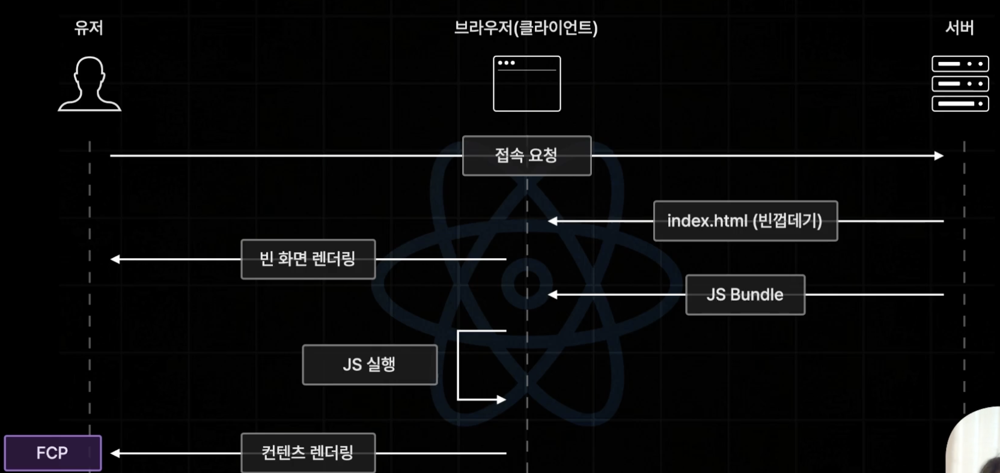
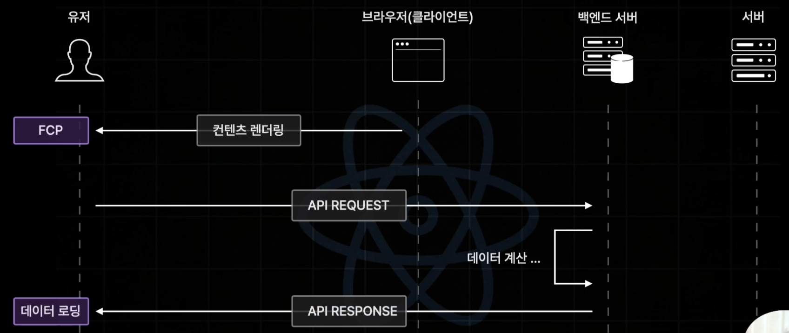
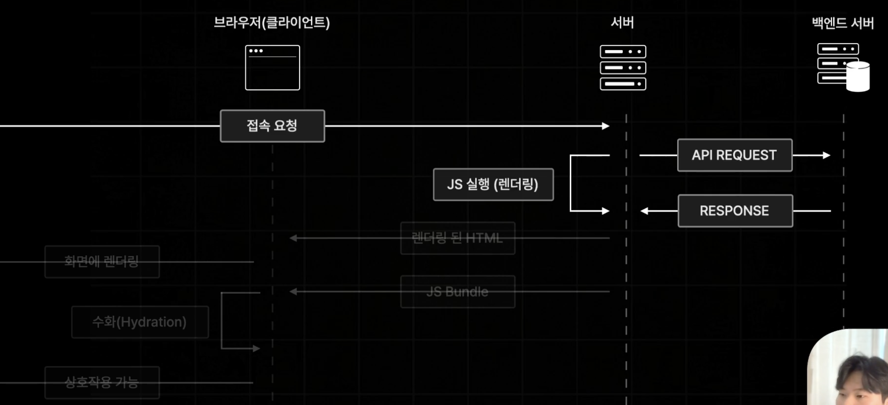
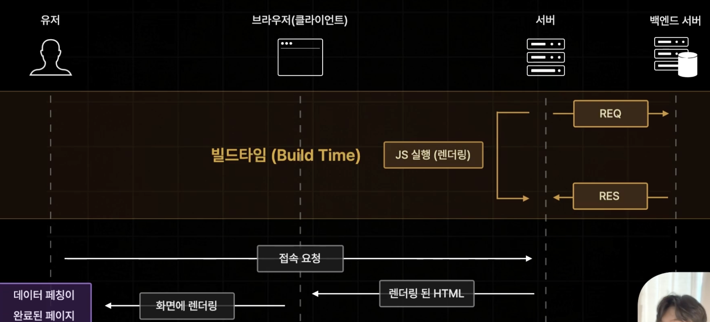

## React의 Data Fetching

React에서 Data Fetching까지는 어떤 과정을 거쳐야 할까?

1. 서버로부터 index.html을 받아서 브라우저가 빈 화면을 렌더링 한다.
2. 서버로부터 JS Bundle을 받아서 브라우저에서 JS를 실행한다.
3. 실행된 JS로 화면을 제대로 그린다.
4. JS까지 포함하여 렌더링이 완료된 후 useEffect가 실행된다.
5. useEffect내부 fetching 코드가 실행되어 API를 요청하고 데이터를 받아와서 데이터를 화면에 그려준다.

> 데이터 패칭 후 화면 렌더링까지 많은 과정이 필요하다.

## Next.js의 Data Fetching

1. 초기 index.html을 받아오기 전에 서버에서 렌더링을 위한 Javascript가 실행될 때 API도 요청한다.
2. 렌더링 된 index.html을 클라이언트로 보낸다.
3. 데이터 패칭이 완료된 페이지를 클라이언트를 바로 볼 수 있다.

> 데이터 요청 시점이 매우 빠르다 !

### Next.js에서 초기 Data Fetching이 오래걸린다면..

npm run build와 같은 빌드타임에 미리 Data를 Fetching하고, 페이지를 사전 렌더링하는 방법이 있다.

> 이게 바로 정적 사이트 생성 (SSG)이다.
> 빌드 타임에 미리 페이지를 사전 렌더링한다.

## Next.js 의 사전 렌더링 방식

Next.js에는 3가지 방식이 있다.

1. 서버사이드 렌더링(SSR)

   가장 기본적인 방식으로 요청이 들어올 때마다 사전 렌더링을 수행한다. (위에서 초기에 서버에서 렌더링 할 때 사용하는 방식)

2. 정적 사이트 생성(SSG)

   빌드 타임에 미리 페이지(index.html)를 사전 렌더링 한다. 유저가 접속하면 미리 데이터 패칭까지 다 해서 빌드된 index.html을 받는다. 자주 변경되지 않는 정적 페이지에 적합하다.

   > 정적 페이지에 SSG가 적합한 이유 : 데이터 Fetching이 다시 일어난다면 빌드를 다시해야 되기 때문에, 실시간 데이터를 필요로 하는 페이지에 적합하지 않다. SSG의 단점을 보완하기 위해 ISR을 사용하여 빌드 후 일부 페이지를 정해진 주기마다 새로 생성할 수 있다. (일정 시간 간격으로 데이터 갱신)

   > 단점 : 페이지를 빌드 타임에 미리 만들기 때문에 SSG 방식을 사용하는 페이지가 많다면, 빌드 타임이 오래걸린다. 빌드 타임에 이미 data Fetching을 하기 때문에 사용자는 계속 reload로 다시 요청해도 최신의 데이터를 받아볼 수 없이 동일한 페이지를 바라보게 된다.

3. 증분 정적 재생성(ISR)

   이 부분은 추후 강의를 듣고 포스팅에 정리할 것이다.
