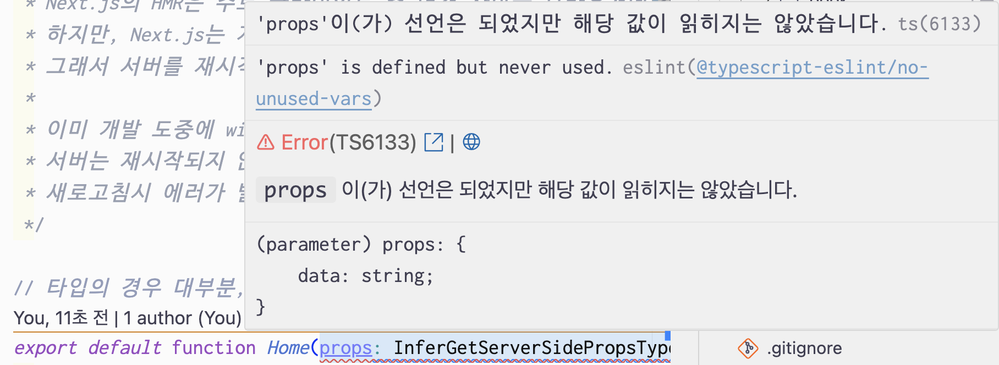

## SSR로 렌더링하기

- getServerSideProps를 붙임으로서 페이지는 이제 SSR방식으로, 사전 렌더링 된다.
- 서버에서 페이지 컴포넌트가 실행되기 전에 이 함수가 먼저 실행된다. (데이터 사전 패칭 가능)
- 페이지 컴포넌트에서 찍는 console도 최초에 서버에서 실행되지만, 브라우저에서도 실행되기 때문에 서버 및 브라우저에서 함께 찍히는 것을 볼 수 있다.
- 클라이언트 환경에서만 실행하고 싶을 경우 useEffect를 사용하여 최초 렌더링 이후 동작하게 하는 방법도 있다.

> 주의
>
> - 서버측에서만 실행되기 때문에 console.log()로 확인하려면 서버측 로그로 확인해야한다.
> - window객체도 사용할 수 없다. window가 undefined이기 때문에 window.location하면 에러가 발생할 것이다.

> HMR에 대해 개인적으로 알아본 부분 !
>
> Next.js의 HMR은 주로 클라이언트 측 변경 사항을 브라우저에 실시간 반영하도록 설계했다. 하지만, Next.js는 개발 모드에서 서버사이드 함수가 변경되었을 때 클라이언트가 최신 데이터를 가져올 수 있도록 처리해두었다. (그래서, 최초 렌더링 이후 data변수 값을 변경해보면 IDE의 서버측 로그에는 찍히지 않지만, 브라우저에서는 계속 찍힌다.) 서버를 재시작하지 않고, 최신 값으로 자동으로 렌더링 할 수 있게 했다.
>
> 이미 개발 도중에 window.location을 사용하는 경우, 금방 얘기한 것처럼 서버는 재시작되지 않고 클라이언트 변경사항만 감지하기 때문에 HMR에서는 에러가 발생하지 않고, 새로고침 시 에러가 발생한다.

```tsx
export const getServerSideProps = () => {
  const data = "Hello, World6!";

  return {
    props: {
      data,
    },
  };
};

export default function Home(props: InferGetServerSidePropsType<typeof getServerSideProps>) {
  useEffect(() => {
    console.log(window);
  }, []);

  return (
    <div className={styles.container}>
      ...
    </div>
  );
}
```


타입의 경우 대부분, Next에서 제공하고 있는 걸 쓸 수 있다.

IDE에서 파라미터에 마우스를 올려보면 Type 추론이 잘 되는 것을 확인할 수 있다.



