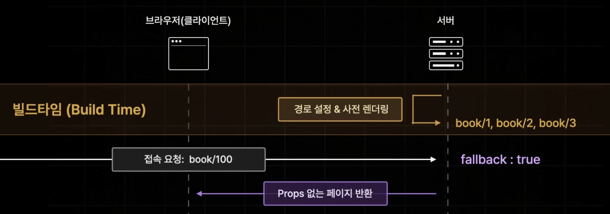

## SSG로 렌더링하기

SSR일 때는 getServerSideProps였다면 이번에는 getStaticProps를 사용하면 된다.
전환 할 때 함수명, 페이지에서 불러올 파라미터의 타입만 바꿔주면 된다.

```tsx
export const getStaticProps = async () => {
  console.log("인덱스 페이지");
  const [allBooks, recoBooks] = await Promise.all([fetchBooks(), fetchRandomBooks()]);

  return {
    props: {
      allBooks,
      recoBooks,
    },
  };
};

export default function Home({ allBooks, recoBooks }: InferGetStaticPropsType<typeof getStaticProps>) {
  return (
    <div className={styles.container}>
			...
    </div>
  );
}
```


## "SSG는 빌드 시에 최초에만 실행된다"를 증명하기

위 코드에서 console.log를 서버측 코드에 넣은 것을 볼 수 있다.

먼저 개발환경에서는 새로고침 할 때마다 console.log가 서버측 로그에 찍히는 것을 볼 수 있다.

실제로 빌드 시 최초 실행되어야할터인데, 왜 계속 찍힐까? 이는 개발 편의성을 위해서다.

PR 환경으로 확인해보자.

1. npm run build

   

   빌드 시에 IDE 로그를 보면 위와 같이 빌드 중에 Static Page를 만들 때 "인덱스 페이지"가 찍히는걸 볼 수 있다.

   > 각 페이지가 어떤 방식으로 라우팅 되어있는지는 기호(꽉찬동그라미, 빈 동그라미, f)를 확인하면 되고, 제일 하단에 설명이 나와있다. Next.js는 기본적으로 페이지에 아무 설정도 해주지 않으면 SSG와 동일한 상태로 정적으로 만들어주는데 이게 빈 동그라미다. SSG처리를 하면 꽉찬 동그라미가 되고, 우리가 SSR로 동작을 지정해서 요청 때마다 새로 API를 요청해야 하거나 페이지가 아닌 파일들은 동적으로 렌더링 된다.

2. npm run start

   빌드 한 결과물로 실행시킨 후에 페이지에서 새로고침을 눌러봐도 서버 측 로그에 getStaticProps에 넣은 console.log가 나오지 않는 것을 볼 수 있다.


## 검색 페이지에 getStaticProps 적용할 수 있을까?

Url 쿼리스트링 방식으로 검색을 할 경우에 SSG방식을 사용할 수 없다.

이유는 빌드 타이밍에는 url에 무엇이 있는지 알 수 없기 때문이다. 그리고 매번 url을 수정해줄 때마다 데이터를 받아와야하는데 그러지도 못한다.

그래서 이런 경우엔 페이지 컴포넌트 내부에서 useEffect같은 것을 이용해서 로직을 짜야한다.


### 하지만, 동적 페이지는 가능하다.

[id].tsx 이런 식으로 만든 페이지에는 입력 가능한 경로들을 미리 제공해주면 미리 그 페이지들을 렌더링해둔다.


만약에, getStaticProps만 사용하고 제공하는 path들을 설정해주지 않으면 아래 에러가 뜬다.


예를 들어서, search/[id].tsx 파일을 SSG로 만들려고 한다고 가정해보고 npm run build를 해서 결과물을 확인해보자.

```tsx
export const getStaticPaths = async () => {
  return {
    paths: [
      { params: { id: "1" } }, // 반드시 문자열로 값을 넣어야 한다.
      { params: { id: "2" } },
      { params: { id: "3" } },
    ],
    fallback: false,
  };
};

export const getStaticProps = async (context: GetStaticPropsContext) => {
  const id = context.params!.id;
  const book = await fetchOneBook(Number(id));

  return {
    props: {
      book,
    },
  };
};

export default function BookDetailPage({ book }: InferGetStaticPropsType<typeof getStaticProps>) {
  if (!book) return "책 정보가 없습니다.";

  const { title, subTitle, description, author, publisher, coverImgUrl } = book;

  return (
    <div className={style["top-container"]}>
      <div style={{ backgroundImage: `url('${coverImgUrl}')` }} className={style.container}>
        
      </div>
      <div className={style.title}>{title}</div>
      <div className={style.subTitle}>{subTitle}</div>
      <div className={style.author}>
        {author} | {publisher}
      </div>

      <div className={style.description}>{description}</div>
    </div>
  );
}
```

위 코드에 대한 결과물로 아래와 같이 미리 파일로 생성되는 것을 볼 수 있다.


결과물은 .next > server > pages에서 각 폴더에 들어가면 html파일을 확인할 수 있다.


## getStaticProps > fallback

fallback 설정으로는 true, false, "blocking" 3가지가 있다.

- blocking : 즉시 생성하고 SSR처럼 getStaticProps가 동작해서 사전 렌더링을 해서 반환한다. (SSG, SSR같은느낌)
- true : 즉시 페이지를 생성하고, props없이 페이지 컴포넌트만 미리 반환한다. (fallback을 이용해서 props없이 미리 페이지를 반환할 때 router.isFallback으로 로딩 페이지를 보낼 수 있다.)
- false : 404로 보낸다.


bloking으로 만들었을 때 최초로 SSG로 동작하고, 없는 페이지 요청 시에는 SSR로 동작하게 가능하다. 예를 들어서, 새로운 도서가 계속 추가되는 그런 경우에도 사용할 수 있겠다.

아래 사진처럼 한번 접근을 시도하면 페이지를 생성해서, 다시 들어올 경우 빠르게 접근이 가능하다.


하지만, blocking의 단점은 getStaticProps에서(서버에서 데이터 패칭)을 할 때 너무 오래걸리는 경우가 있을 수 있다.


그래서, true로 해주게 되면 일단 props없이 페이지를 반환하고 그 다음 서버에서 패칭이 끝나면 새로 페이지를 그려줄 수 있다.




로딩은 아래와 같이 fallback 상태일 때의 UI를 추가할 수 있다.

```tsx
export default function BookDetailPage({ book }: InferGetStaticPropsType<typeof getStaticProps>) {
  const router = useRouter();
  if (router.isFallback) return <div>로딩 중...</div>;
  if (!book) return "책 정보가 없습니다.";

  const { title, subTitle, description, author, publisher, coverImgUrl } = book;

  return (...)
}
```


그런데, 이렇게 할 경우 book이 null인 경우는 정말 책 정보가 없을수도 있지만 에러가 발생한 경우에도 book이 falsy할 것이다. 그렇기 때문에 책 정보가 정말 없을 때는 아래와 같이 getStaticProps내부에서 없는 책 정보일 경우 not found페이지로 보낼 수도 있다.

```tsx
export const getStaticProps = async (context: GetStaticPropsContext) => {
  const id = context.params!.id;
  const book = await fetchOneBook(Number(id));

  // 책이 없을 경우 notFound 페이지로 보낼수도 있다.
  if (!book) {
    return {
      notFound: true,
    };
  }

  return {
    props: {
      book,
    },
  };
};
```

