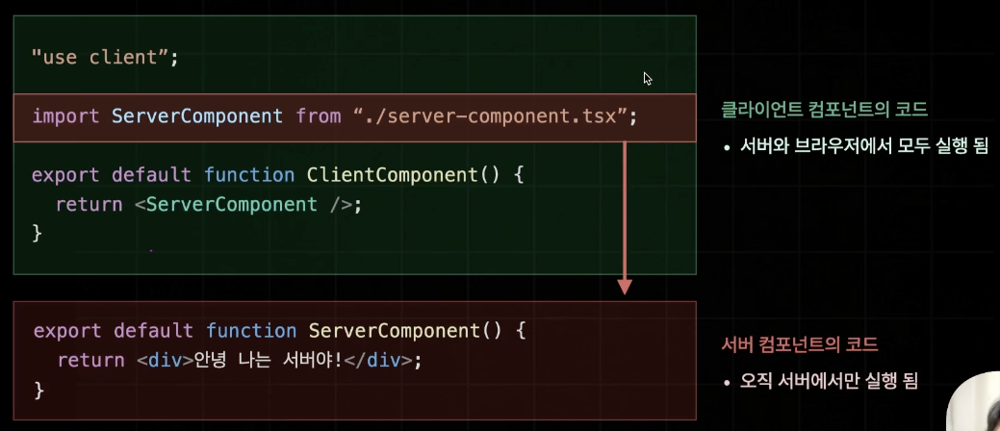
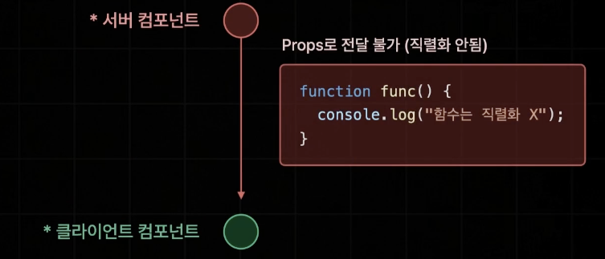
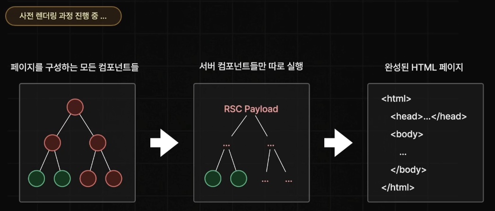

## ServerComponent

기존 Page Router에서는 JS Bundle을 서버로부터 브라우저가 받을 때 Hydration이 필요없는 즉, 이벤트핸들러나 상태를 가지고 있지 않아서 서버로부터 1번만 렌더링하면 되었었던 컴포넌트까지도 JS Bundle로부터 받아서 Hydration을 하고 있었다.

하지만, React18에서 등장하게 된 서버컴포넌트들은 서버에서만 실행되고 JS Bundle에는 포함되지 않아서 브라우저에서 실행되지 않는다.

> - 클라이언트 컴포넌트는 서버에서 사전 렌더링 1번, Hydration을 진행할 때 1번 해서 총 2번 실행되는 것이다. 
> - 공식문서에서는 페이지 대부분을 서버 컴포넌트로 구성할 것을 권장한다. 클라이언트는 꼭 필요한 경우에만 사용할 것!

App Router에서는 아무것도 해주지 않으면 그 자체로 서버 컴포넌트다. 그렇다면 key같은 것들이 있어도 괜찮은 것이다. 반면 React hooks들은 호출할 수 없다.

## ClientComponent

만약 ClientComponent로 사용하고 싶다면 파일 최상단에 'use client'를 써주면 된다.

> 주의 : 다시한번 상기하자면, 클라이언트 컴포넌트라고 브라우저에서만 실행되는 것이 아니라 서버에서 1번, 브라우저에서 1번 실행된다.

## 사용처 정하기

앞서 몇 번 얘기한 것처럼 상태나 이벤트핸들러같이 사용자와 상호작용이 있다면 client component로 만들면 된다.

> 주의 : Link들은 서버컴포넌트다. 이유는 HTML자체에서 제공하는 페이지 이동 기능이기 때문이다.

## 주의 사항 총정리

- 서버컴포넌트에는 브라우저에서 실행될 코드가 포함되면 안된다.

  - import하는 라이브러리도 마찬가지 !

- 클라이언트 컴포넌트는 브라우저에서만 실행되지 않는다.

- 클라이언트 컴포넌트에 서버 컴포넌트를 import할 수 없다.

  서버에서 실행 될 때는 클라이언트 컴포넌트내부에서 서버 컴포넌트를 import하고 있는 것이 문제가 없을 것이다. 하지만, 브라우저에서 봤을 때 클라이언트 컴포넌트 내부에 있는 서버 컴포넌트를 찾을려고 해도 이미 없기 때문에 문제가 된다.

  

​	> 하지만 개발을 하다보면 뒤섞일 가능성이 높다. 그래서 에러 때문에 개발 진행이 어려워질 수 있다. 이에 Next.js에서는 자동으로 클라이언트 컴포넌트 내부에 있는 서버 컴포넌트를 클라이언트 컴포넌트로 변경한다.

- 서버 컴포넌트에서 클라이언트 컴포넌트에게 직렬화 되지 않은 Props는 전달 불가하다.

  

​	

## 클라이언트 컴포넌트 하위에 서버컴포넌트가 들어가야만 한다면?

만약 이런 상황일 경우 클라이언트 컴포넌트 내부에서 서버 컴포넌트를 사용하는 것이 아니라, 클라이언트 컴포넌트 내부에 children을 뚫어서 서버 컴포넌트를 전달하면 된다.

> 이유 : 브라우저에서는 ServerComponent를 그냥 렌더링만 해주는 것이기 때문에 ClientComponent와 무관해진다.

## Server Component -> 클라이언트 컴포넌트 Props 전달 방법

- 직렬화 한 데이터는 보낼 수 있다.
- 함수는 전달 불가능하다. (직렬화 불가능)

	

- 사전 렌더링에서 서버 컴포넌트들은 서버에서 먼저 실행된다. 이 때 JSON과 비슷한 문자열인 RSC Payload형태로 존재한다. 쉽게 말해서 RSC Payload는 React Server Component를 직렬화 한 결과다. 여기에 클라이언트 컴포넌트에게 전달하는 Props값이 포함되어 있다. 결과적으로 RSC Payload와 클라이언트 컴포넌트가 합쳐져서 HTML페이지가 생성된다.

