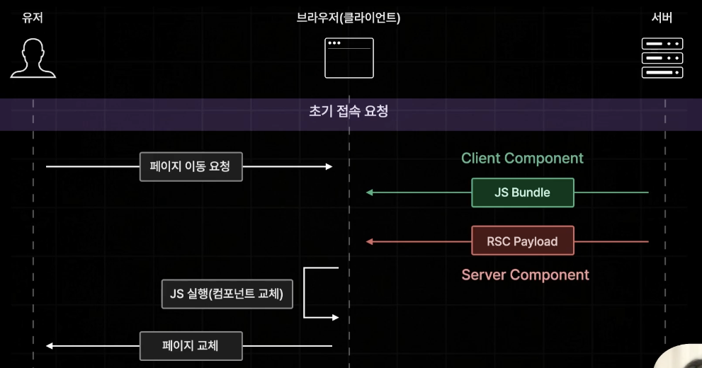
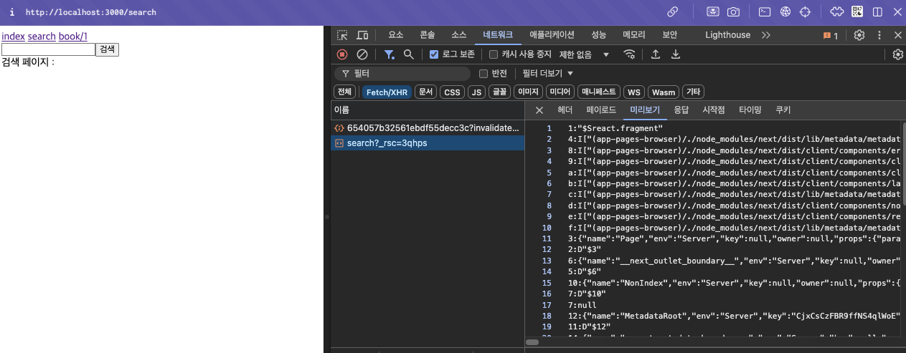
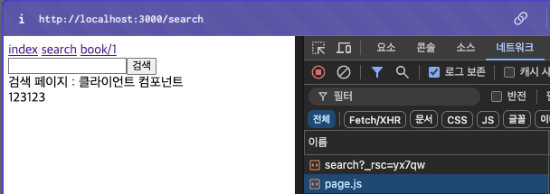
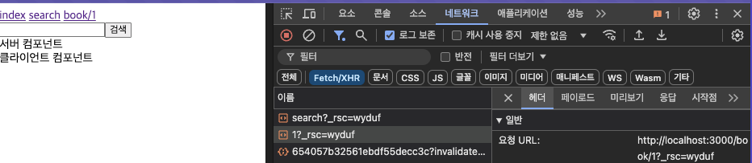
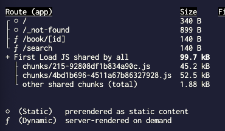

## Navigating

페이지 이동은 CSR 방식으로 처리된다. (Page Router버전과 동일하다.)

페이지 이동 시 JS Bundle과 RSC Payload를 받는데, 이유는 간단하다.

클라이언트 컴포넌트 관련 내용은 JS Bundle에 있고, 서버 컴포넌트 관련 내용은 RSC Payload에 있다.




## 서버 컴포넌트만 있는 페이지로 이동

만약, 서버 컴포넌트로만 이루어진 페이지로 이동 시 아래 캡처처럼 서버로부터 뒤에 rsc가 붙은 파일을 전달받는 것을 볼 수 있다. 여기있는 내용이 RSC Payload내용이다. 



만약, 클라이언트 컴포넌트가 포함되어있다면 JS Bundle도 함께 받을 것이다.




## 프로그래매틱한 페이지 이동

예를 들면 어떤 버튼을 눌렀을 때 이벤트 핸들러를 통한 페이지 이동을 말한다.

`next/navigation`에서 useRouter를 꺼내서 프로그래매틱하게 페이지를 이동할 수 있다. 이 때 주의할 점은 next/router에서 useRouter를 꺼내면 안된다는 점이다.

```tsx
// src/components

"use client";

import { useRouter } from "next/navigation";
import { useState } from "react";

export default function Searchbar() {
  const [search, setSearch] = useState("");
  const router = useRouter();

  const onChangeSearch = (e: React.ChangeEvent<HTMLInputElement>) => {
    setSearch(e.target.value);
  };

  const onSubmit = () => {
    router.push(`/search?q=${search}`);
  };

  return (
    <div>
      <input onChange={onChangeSearch} value={search} />
      <button onClick={onSubmit}>검색</button>
    </div>
  );
}

```


## Pre-fetching 알아보기

build 후에 start로 실행시켜보면 navigation에 있는 페이지들(rsc 파일들)을 볼 수 있다.




## 빌드 결과물을 다시 봐보기

- Static 이라고 써져있는 것들은 Page Routing배울 때 SSG방식으로 불러오는 것처럼 빌드 타임에 미리 생성된 페이지다.
- Dynamic 이라고 써져 있는 것들은 SSR방식이라고 보면 된다. 브라우저의 요청을 받으면 생성한다.



> 이 두 가지를 나누는 기준은 무엇일까?  
>
> 기본적으로는 Static으로 생성되지만 url 파라미터를 꺼내온다거나 쿼리스트링으로 꺼내오는 등 빌드타임에 생성하면 안될 것 같은 페이지들은 자동으로 Dynamic으로 설정된다. 이렇게 생성된 페이지들은 프리패칭 방식에서도 차이가 있다. 브라우저에서 Static으로 미리 생성된 페이지는 데이터 업데이트가 필요없으므로 프리패칭으로 js 파일과 RSC파일을 함께 받아오고, Dynamic하게 생성되는 페이지들은 데이터 업데이트가 필요할 수 있기 때문에 RSC 파일만 미리 받아오고, 페이지 진입 시 js파일까지 받아온다.


## 핵심

핵심은 페이지 접속 시, 서버 컴포넌트는 RSC로 받아오고 클라이언트 컴포넌트가 포함된 페이지는 RSC + js bundle을 받아온다는 것을 기억하자.