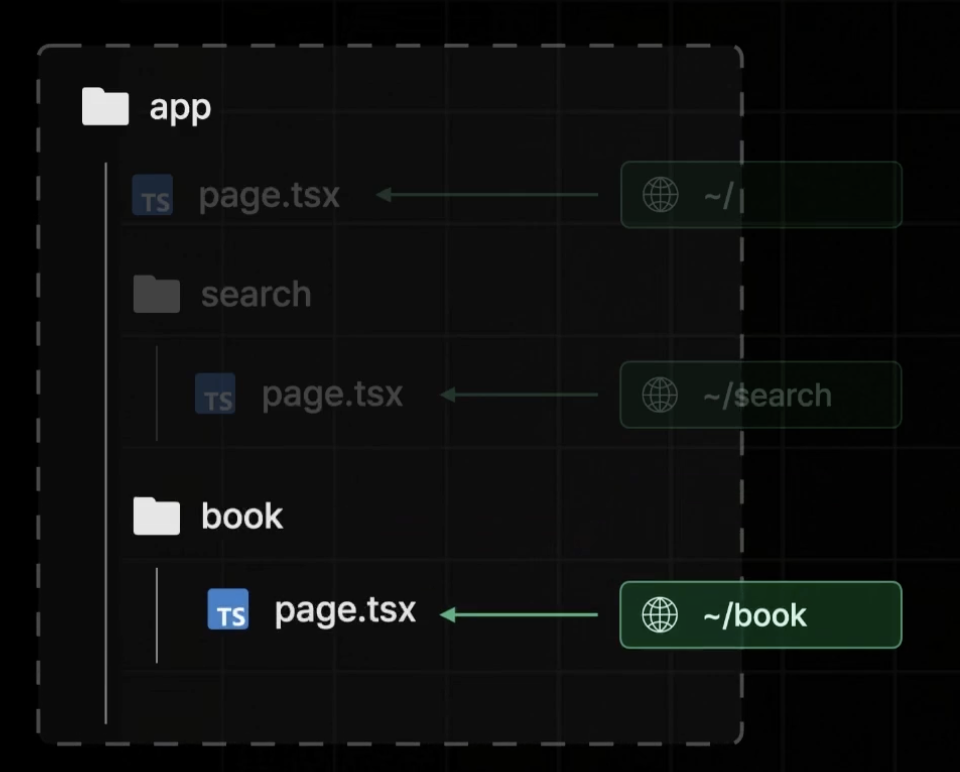
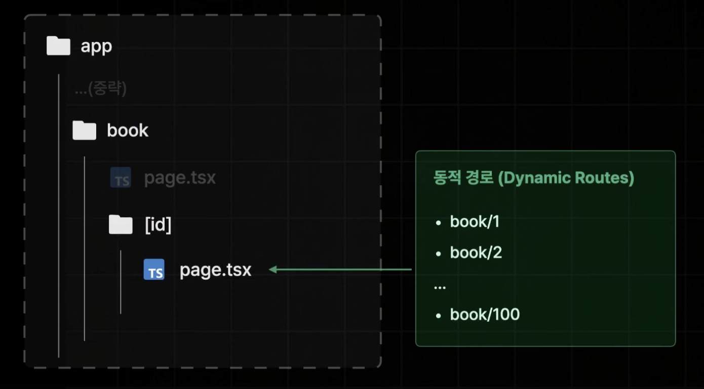

## App Router

Next.js 13버전에 새롭게 추가된 라우터다. 기존의 Pages Router를 대체한다.

## 주요 변경되거나 추가되는 사항

- React18 신규 기능 추가 (서버 컴포넌트 같은 것)
- 데이터 패칭 방식 변경
- 레이아웃 설정 방식 변경
- 페이지 라우팅 설정 방식 변경

## 페이지 라우팅과 크게 변경되지 않는 사항

- 네비게이팅
- pre-fetching (프리패칭)
- pre-rendering (사전 렌더링)

## 페이지 라우팅 생성하기

Pages Router 방식과 다르게 App Router 방식에서는 page.tsx 파일이 페이지 역할을 하게 된다.

경로 자체는 Page Router 방식과 동일하다.

그래서 동적 경로를 만들 때도 아래와 같이 폴더는 주소가 되고, page.tsx 파일이 그 주소의 페이지가 된다.

