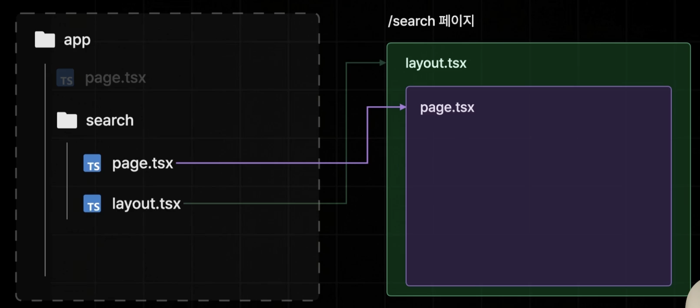
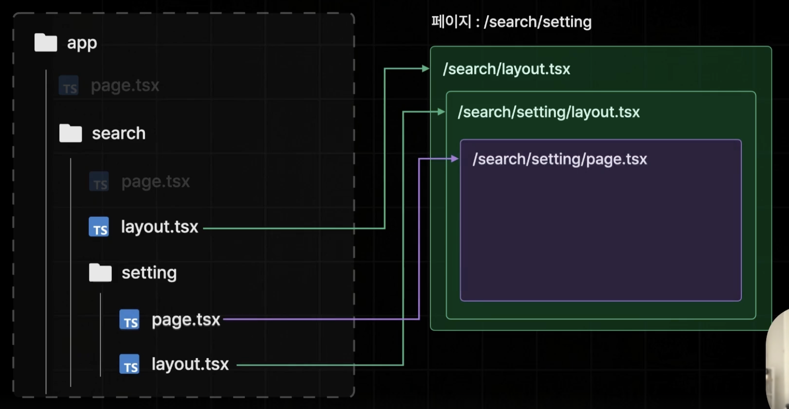

## Layout

각 경로에서 page를 만들 때 page.tsx로 만들었다면, layout을 만들 때는 layout.tsx로 만들면 된다.

page는 layout의 children으로 들어온다.




## Layout은 하위 자식들의 부모 Layout이 된다.



> 최상단에 있는 layout.tsx 파일의 경우에는 없으면 안되서 만약, 파일명을 변경하면 Next가 알아서 layout.tsx 파일을 만든다.


## Route Group

2개 이상 페이지에 동일한 Layout을 적용하고 싶은 경우에 쓰는 방법이다.

소괄호로 폴더명을 만들면 되고 경로상에 아무 영향도 끼치지 않는다.

예를 들어서, 메인 페이지와 검색 페이지에만 동일한 SearchBar가 있는 Layout을 적용하고 싶은 경우 다음과 같이 할 수 있다.

```tsx
📦(with-searchbar)
 ┣ 📂search
 ┃ ┗ 📜page.tsx
 ┣ 📜layout.tsx
 ┣ 📜page.module.css
 ┗ 📜page.tsx
```

Route Group을 이용해서 메인 페이지와 Search Page를 한번에 묶는다.

그 다음 layout.tsx를 메인 페이지와 함께 두고 하위에 있는 search/page.tsx도 함께 적용될 수 있도록 할 수 있다.

> Page Router의 layout과 비교했을 때 File Tree만 봐도 직관적으로 적용한 layout을 구별할 수 있어서 가독성이 좋아보인다.