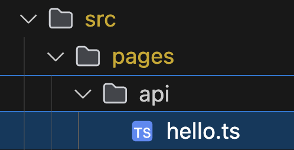
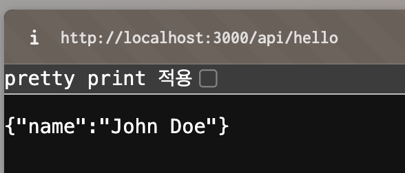

Next.js에서 API를 구축하는 방법이다. API Routes 들을 직접 만들 수 있다.


src/pages/api 파일 위치에 hello.ts 파일을 만든 것을 볼 수 있다.

/api/hello 가 API의 주소가 되는 것이다.




내부에는 아래 코드가 있다.

```ts
// Next.js API route support: https://nextjs.org/docs/api-routes/introduction
import type { NextApiRequest, NextApiResponse } from "next";

type Data = {
  name: string;
};

export default function handler(
  req: NextApiRequest,
  res: NextApiResponse<Data>,
) {
  res.status(200).json({ name: "John Doe" });
}
```


실제로 받아오는 것을 볼 수 있다.




일단은 크게 사용할 일이 없기 때문에 이런게 가능하다 정도로만 알아두자.

> 실제로 이런 것이 있다고 알아두는 것과 아예 모르는 것은 차이가 있다.