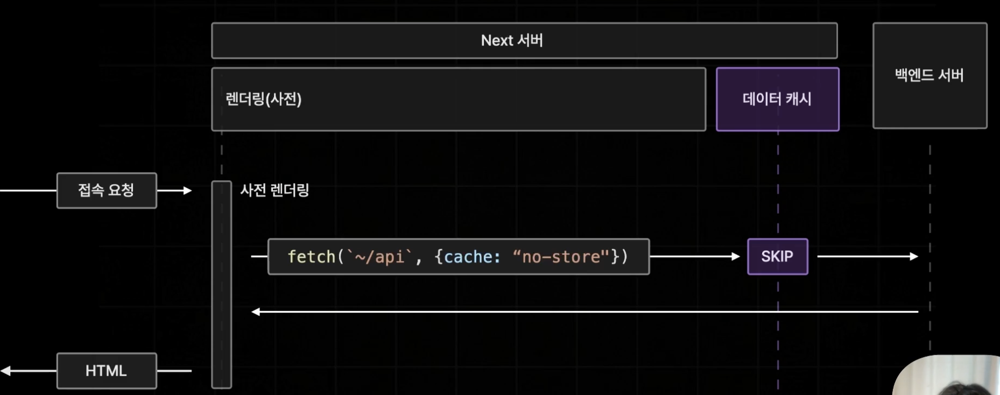
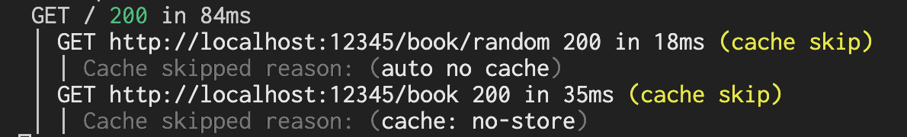
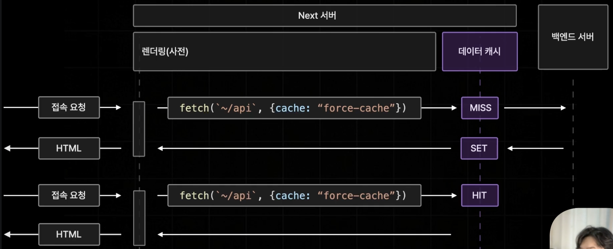
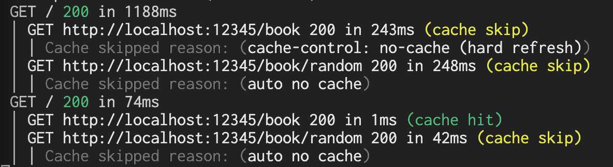
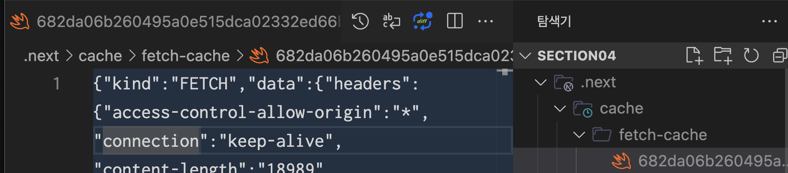
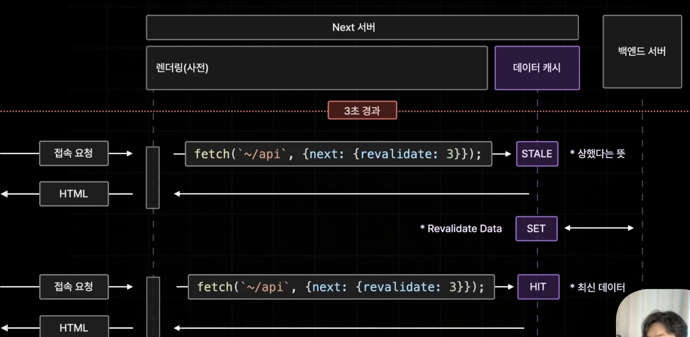

## Data Cache

Next.js에서 Data를 Cache하고 싶다면 fetch 메서드만을 사용해야 하고 만약, 무조건 1번만 호출하고 싶다면 아래와 같이 옵션을 주면 된다. (Next에서 제공하는 fetch 메서드다. 일반적인 fetch 메서드가 아니다.)

```tsx
await fetch('~/api', { cache: "force-cache" })
```


### cache: "no-store"

데이터 패칭의 결과를 저장하지 않는다. (캐싱을 아예하지 않는다.)

```tsx
await fetch('~/api', { cache: "no-store" })
```



Next 서버에서 사전렌더링이 될 때 fetch 메서드를 통해 API를 요청할 때 데이터 캐시를 하지 않고 다이렉트로 백엔드 서버로 간다.


## cache 보관여부를 보기 위해 api log찍어보기

`next.config.ts`파일에 logging > fetches > fullUrl을 `true`로 주게 되면 아래 캡쳐와 같이 요청하는 API들의 로그를 남겨준다.

```ts
// next.config.ts
const nextConfig: NextConfig = {
  /* config options here */
  logging: {
    fetches: {
      fullUrl: true,
    },
  },
};
```


아래 로그를 보면 /book api에 "no-store" 옵션을 부여한 모습이다. 위 로그는 기본값인데 기본적으로 cache를 보관하지 않는다는 것을 알 수 있다. 즉, 기본값은 no-store와 동일하다.

> 15버전부터는 기본값이 캐시를 보관하지 않는 것이지만, 14버전까지만 해도 캐시를 보관했다.




## cache: force-cache

위에서 살펴봤듯이, 캐시를 무조건 저장하는 방법이 있다. 이렇게 저장하게 되면 제일 처음에 백엔드 서버에 요청 시에는 캐시된 바가 없기 때문에 백엔드 서버로 그대로 요청하고, 그 다음 요청 시 이미 가지고 있던 캐시를 내려받는다.




로그를 찍어보면 다음과 같다.




json형식으로 보관되어있는 캐시 데이터도 확인할 수 있다.




## next: { revalidate: 3 }

몇초마다 기존 캐시를 사용하지 않고, 새로운 데이터를 불러올 지 결정할 수 있다.

```tsx
const response = await fetch(`/api`, {
  next: {
    revalidate: 3,
  },
});
```


자세하게 설명하면 최초 요청 및 3초(예시) 이내로 요청했을 경우에는 force-cache와 동일하다. 하지만, 3초 이후에 요청하면 기존에 stale한 데이터를 미리 보여주고 백엔드서버로부터 신선한 데이터를 받아와서 보여준다.




## next: { tags: ['a'] }

뒤에 서버 액션을 다루고 나서 기입한다.