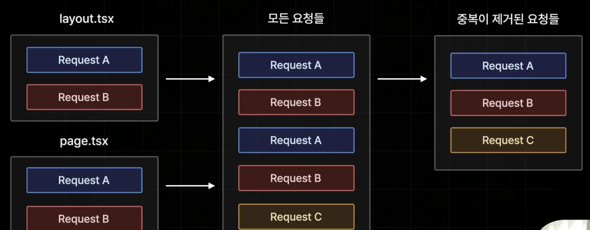
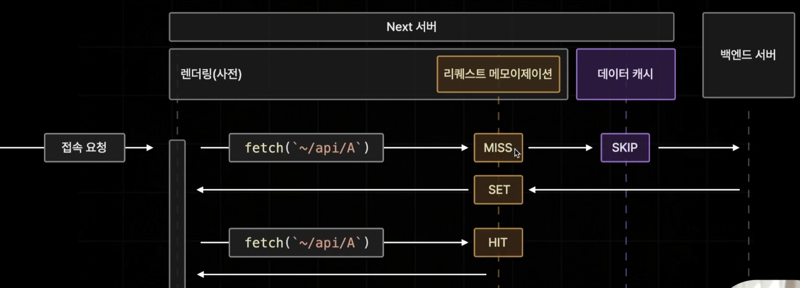
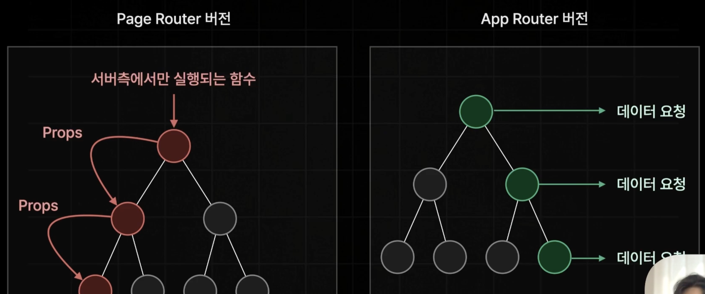
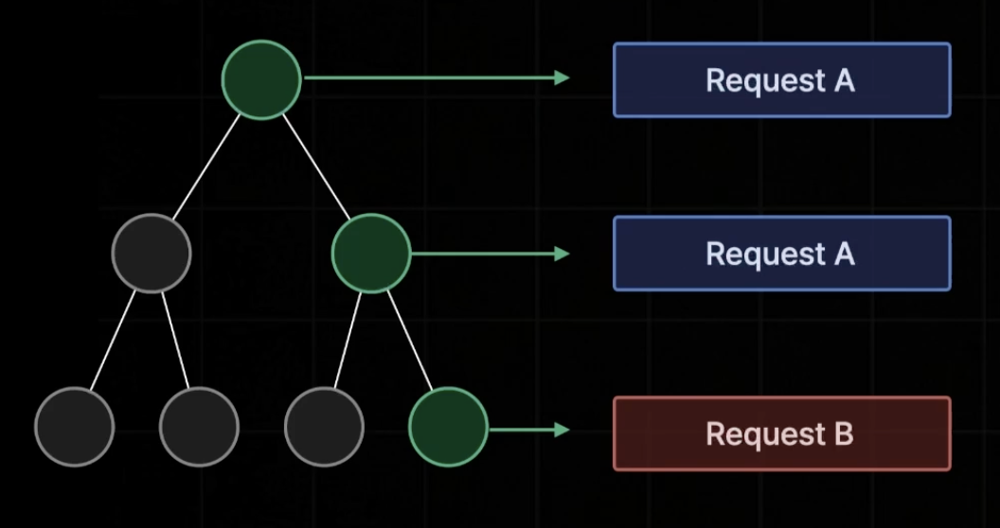
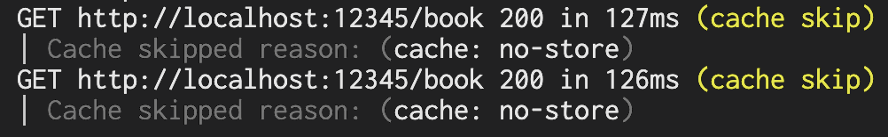
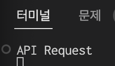

```
layout: ../../../layouts/MarkdownPostLayout.astro
pubDate: 2024-11-09
title: '[Next.js][App Router] Request Momoization'
description: 'Request Momoization'
tags: ["Next.js"]
```


## Request Memoization

각 페이지 컴포넌트들에서 중복적으로 API를 요청하고 있을 경우 단 1번만 요청할 수 있게 최적화를 수행한다.




그림으로 도식화해보면 다음과 같다.

리퀘스트 메모이제이션 캐시가 있는지 확인하고, 없으면 백엔드서버까지 가서 API를 요청한다. 중복으로 호출하는 다른 API들의 경우 리퀘스트 메모이제이션 캐시에 있는 데이터를 HIT해서 가져올 수 있게 된다.



데이터 캐시와는 다른 점이 있다. 페이지 렌더링이 다 되고나면 리퀘스트 메모이제이션 캐시는 소멸된다. 즉, 렌더링 할 때 중복된 API호출을 예방하는 목적만 두고 있는 캐시다.


## Request Memoization의 등장 배경

Page Router 버전에서는 Request Memoization이 필요없었다. 서버컴포넌트가 없었고, Root에서 getStaticProps같은 함수에 의해 서버에서 API를 호출하고 자식들에게 props로 데이터를 넘겨주는 구조여서 API를 1번만 요청했을 것이다.




하지만, 서버 컴포넌트의 도입으로 원하는 곳 어디든 API를 요청할 수 있게 되었는데 이에 따라 중복된 API를 요청하게 되었다.




## Request Memoization 정상 동작하지 않나?

로그를 찍어봤는데 페이지를 렌더링 할 때 각자 다른 컴포넌트에서 호출되는 API가 2번 찍히는 현상을 발견했다.




그런데, 백엔드 서버 측 코드에 로그를 찍어보면 1번만 찍히는 것을 알 수 있다.



> React15 RC버전에서는 프론트 서버 측 로그에서도 1번만 찍혔는데, 15버전이 정식 출시되면서 생긴 버그인 것 같다.


