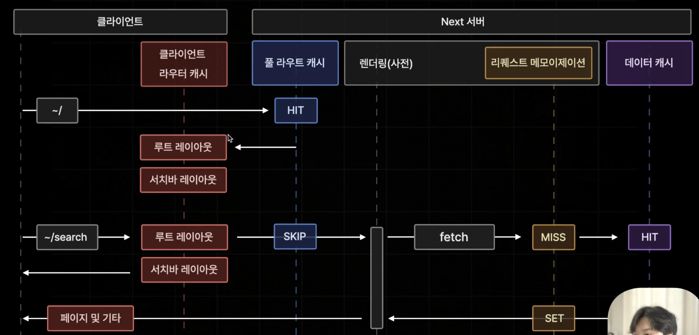

```
layout: ../../../layouts/MarkdownPostLayout.astro
pubDate: 2024-11-09
title: '[Next.js][App Router] Client Route Cache'
description: 'Client Route Cache'
tags: ["Next.js"]
```


## Client Route Cache

현재 우리가 알고 있는 Next.js 지식으로 정리해봤을 때 A라는 정적 페이지에 접속했을 때 미리 풀라우트 캐시에 있는 페이지를 화면에 그리고, B페이지라는 동적페이지에 접속했을 때 동적으로 B페이지를 그리게 된다.

그런데, A와 B페이지에서 함께 사용하고 있는 Layout의 경우 2번 불러오게 되는 손해가 발생한다. 

### Next.js는 RSC Payload내부에 있는 레이아웃을 최적화한다.

RSC Payload 내부에 레이아웃을 클라이언트에 저장하여, 중복되는 부분은 클라이언트에서 자동으로 처리한다.





## 확인해보자!

직접 눈으로 봐보자. 

layout 컴포넌트에 현재 시간을 기록하고, 동일한 레이아웃을 사용하고 있는 페이지로 url을 변경해서 이동해보면 시간이 그대로인 것을 확인할 수 있다. 

> 새로고침 및 탭을 종료 후 다시 접속하면 클라이언트 라우트 캐쉬는 모두 초기화된다.

```tsx
export default function Layout({ children }: { children: ReactNode }) {
  return (
    <div>
      <p>{new Date().toLocaleString()}</p>
      ...
```


