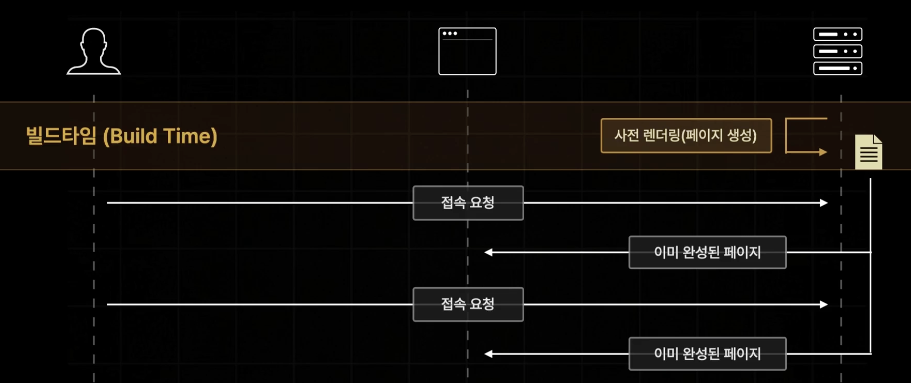
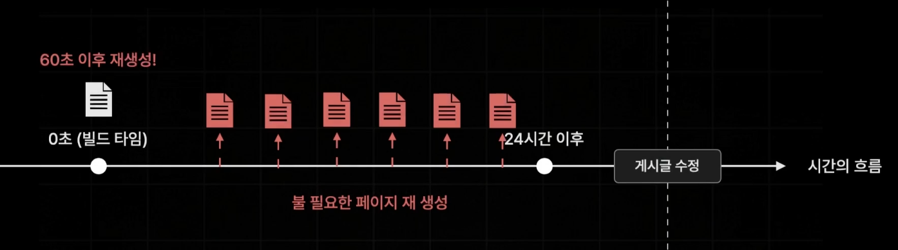
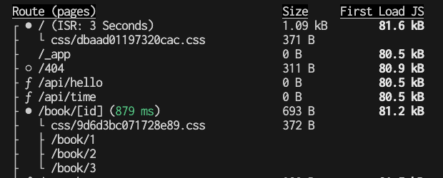

## ISR(Incremental Static Regeneration) : 증분 정적 재생성

이름과 다르게 단순하다. "SSG방식으로 생성된 정적 페이지를 일정 주기로 다시 생성하는 기술"이다.


## 왜 이 기술이 탄생하게 되었을까?

기존 SSG 방식은 빌드에 생성된 렌더링 페이지를 요청할 때마다 동일한 페이지를 응답해주는 것이었다.




음식처럼, 유통기한을 설정해서 해당 페이지를 다시 정적으로 생성해준다.

좀 더 자세하게 살펴보면, 60초로 설정 시 60초 이후에 접속을 하면 처음에는 초기버전을 반환하면서 새로 패칭된 페이지를 만들어놓고 그 다음 접속 시 그 페이지를 반환한다.


## 어떤 경우에 적합할까?

"지금 추천하는 도서"처럼 매번 똑같은 리스트보다는 다르게 주고 싶을 때 적합하다.

단, 시간과 관계없이 사용자의 행동에 따라 데이터가 업데이트 되는 페이지에는 적용하기 어렵다.

예를 들어, 커뮤니티 사이트의 게시글 페이지같은 경우 적용하기 어렵다. (작성자가 언제 수정할지 모른다 or 사용자가 수정하기 전에 계속 불필요한 페이지 재생성)




## 적용하는 방법

getStaticProps의 반환 속성에 props의 형제로 revalidate를 추가하고 초를 설정하면 된다.

```tsx
export const getStaticProps = async () => {
  const [allBooks, recoBooks] = await Promise.all([fetchBooks(), fetchRandomBooks()]);

  return {
    props: {
      allBooks,
      recoBooks,
    },
    revalidate: 3, // 재검증하다라는 뜻. 3초마다 재검증하겠다 라고 생각하면 된다.
  };
};
```


결과는 아래와 같이 ISR방식으로 3초가 적용될 것을 볼 수 있다.




> 일반적으로 SSG방식보다 ISR방식을 추천한다고 한다.


## ISR이 완벽한가?

위 예시에서 잠깐 언급했듯이, 시간에 관계없이 업데이트가 필요한 경우에는 ISR이 적합하지 않다. 따라서, Next.js는 요청을 받을 때 페이지를 다시 생성하는 On-Demand ISR 방식을 제공한다.

```ts
// pages/api/revalidate.ts
import { NextApiRequest, NextApiResponse } from "next";

export default async function handler(rq: NextApiRequest, rs: NextApiResponse) {
  try {
    await rs.revalidate("/"); // index 경로의 페이지를 재생성
    return rs.json({ revalidate: true });
  } catch (error) {
    return rs.status(500).send("Revalidation Failed");
  }
}
```


이번에도 PR 상에서 어떻게 되는지 확인해보기 위해 npm run build, npm run start를 실행해보자.

메인 페이지('/')에 접속해서 새로고침을 계속 해봐도 동일한 페이지가 나온다.

하지만, `localhost:{port}/api/revliate` 로 접속하는 순간 rs.revalidate('/')가 실행되면서 index.html 파일을 재생성하고, 다시 메인페이지로 들어가서 새로고침하면 새로운 페이지를 받아오는 것을 볼 수 있다.

