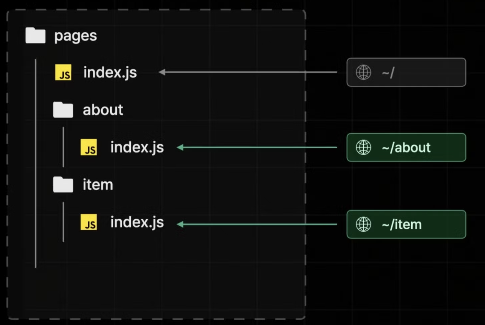

> **Next.js의 Pages Router를 현재에 와서 알아보는 이유**
>
> Next.js를 사용했을 당시에 Pages Router를 사용했었으나 시간이 오래 흘러서 상당 부분 까먹었다.
> 그래서 App Router를 본격적으로 사용하기 이전에 이전 기술과 비교하기 위해 알아보기로 했다.

- Page Router는 Next.js 13버전 이상에서 나온 App Router이전에 사용했던 방법이다.
- App Router가 왜 등장하게 되었는지를 알아보기 위해 Page Router를 사용해보자.
- `Pages` 폴더 구조를 기반으로 페이지 라우팅을 제공한다.


## 경로 설정 방법

- 파일명이 경로가 된다.

- 혹은 폴더명/index.js가 있을 경우 폴더명이 경로가 된다.

  

- 동적 경로 만드는 방법

  item/`[id].js` 대괄호를 이용하면 된다.

  

## src/pages 파일 살펴보기

- _app.tsx, _document.tsx 파일은 공통 로직, 공통 레이아웃 역할을 한다.

- _app.tsx 파일의 경우에는 React에서처럼 Root컴포넌트 역할을 한다. Next.js에서는 모든 페이지의 부모 컴포넌트라고 보면 된다. 즉, 어떤 페이지를 띄우던간에 _app.tsx 자식으로 동작한다고 보면 된다. 그래서 header같은 공통 컴포넌트를 여기에 추가할 수 있다.

  ```jsx
  // 실제 로직을 보면 자식 Component를 그대로 받아오고 pageProps를 전달하는 모습이다.
  export default function App({ Component, pageProps }: AppProps) {
    return <Component {...pageProps} />;
  }
  ```

  > React Chrome Extension으로 봐도 App 밑에 페이지 컴포넌트가 있는걸 볼 수 있다.

- _document.tsx 파일은 기존 React에서 index.html과 비슷하다. 모든 페이지의 html부분을 담당한다. meta tag, charset, ga같은 것을 보통 넣는다.

  ```tsx
  export default function Document() {
    return (
      <Html lang="en">
        <Head />
        <body>
          <Main />
          <NextScript />
        </body>
      </Html>
    );
  }
  ```


## 쿼리스트링 및 동적경로 읽는 방법

### 1. 쿼리스트링

주소로 localhost:3005/search?q=박태준 이라고 썼을 경우 쿼리파람인 q의 값을 읽어보자.

`search/index.tsx`

```tsx
// next/navigation은 App Router에서 사용하기 때문에 next/router에 있는 useRouter를 꺼내온다.
import { useRouter } from "next/router";

export default function Page() {
  const router = useRouter();

  const { q } = router.query;

  return <h1>{q}</h1>;
}
```


### 2. 동적경로

localhost:3005/book/1 이라고 썼을 경우 path에서 1을 반환받아보자.

`book/[id].tsx`

```tsx
import { useRouter } from "next/router";

export default function Page() {
  const router = useRouter();

  const { id } = router.query;

  return <h1>book {id}</h1>;
}
```

> router.query.id로 1이 들어가는 것을 확인할 수 있다.


### 3. 여러 동적경로

localhost:3005/book/1/2/3 이런 식으로 여러 path가 있는 경우를 가정해보자.

`book/[...id].tsx` 로 파일명을 만들면 된다. 그러면 id 값은 ['1', '2', '3']이 된다. 위 예시에서는 렌더링으로 123이 나온다.


### 4. 여러 동적경로이지만, index.tsx파일이 없는 경우에도 대응

localhost:3005/book 딱 이 경로까지만 요청할 경우 catch all segment(`[...id]`)의 경우나 동적 경로에서 읽을 수 없어서 404가 뜬다. 이럴 때 optional catch all segment를 사용할 수 있다. 대괄호로 한번 더 감싸주면 된다. `[[...id]]`


## 404페이지 만들기

pages 하위에 404.tsx 파일을 만들어주면 된다. 간단하다.


## 네비게이팅

Next.js에서는 Link컴포넌트를 활용해서 클라이언트 사이드 렌더링을 구현할 수 있다. 일반적인 a태그와는 동작이 다르다. 프로그래매틱하게 이동(Link버튼 클릭이 아니라 어떤 조건을 만족했을 때 페이지 이동)하기 위해서는 next/router에 있는 useRouter에서 push메서드를 이용할 수 있다.

```tsx
const router = useRouter();
  
  const handleClickButton = () => {
    router.push("/test");
  };
```


## 프리패칭

페이지를 미리 불러올 수 있다. 예를 들어서 /a로 가는 링크, /b로 가는 링크가 있을 때 각 페이지를 pre-fetch할 수 있다. 이동할 가능성이 있는 모든 페이지의 데이터를 미리 불러옴으로서 빠르게 이동할 수 있도록 한다.

일반적으로 React의 경우에는 JS Bundle을 받아올 때 모든 컴포넌트 데이터를 받아오지만, Next의 경우에는 현재 페이지 데이터만 JS Bundle로 받아온다. (모든 페이지 번들파일을 전달할 경우에는 용량이 커져서 Hydartion이 늦어진다. 그러면 TTI가 늦어진다.)


그렇다면 결과적으로 페이지 이동시마다 JS Bundle을 받아와야 하고 속도가 느려지게 된다. 리액트의 장점을 제대로 누릴 수가 없는 것이다.


이런 문제를 방지하기 위해 Pre-fetching이 있다. 페이지에 있는 모든 링크(사용자가 이동할 가능성이 있다고 추측)에 대해 파일들을 미리 로드한다. 이 타이밍은 초기 JS Bundle이 아니라 초기 접속 이후에 진행되서 초기 Hydration속도도 빠르게 하고 이동할 페이지들의 데이터를 미리 fetching해놓음으로서 리액트와 동일하게 동작할 수 있게 한다.


하지만 dev모드에서는 프리패칭이 일어 나지 않는다. 따라서 링크를 클릭할 때마다 js bundle파일을 받아오는 것을 볼 수 있다.


