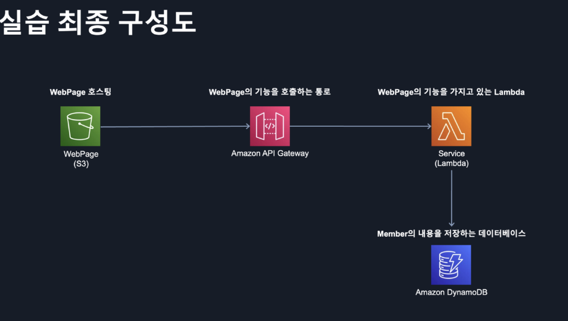
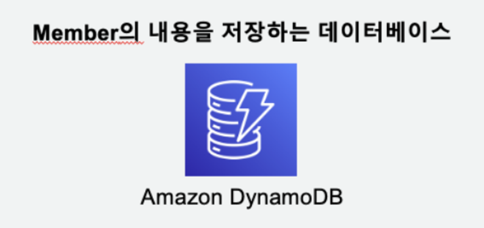
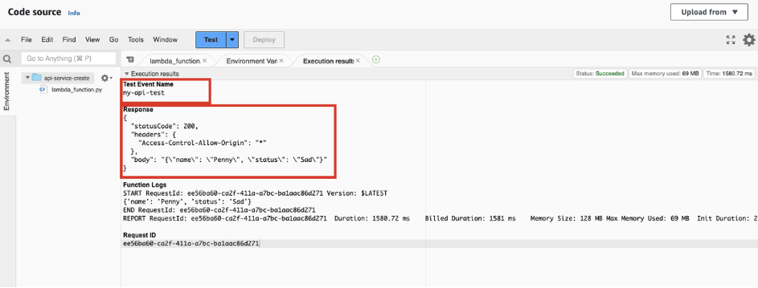
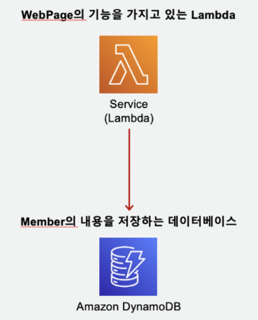
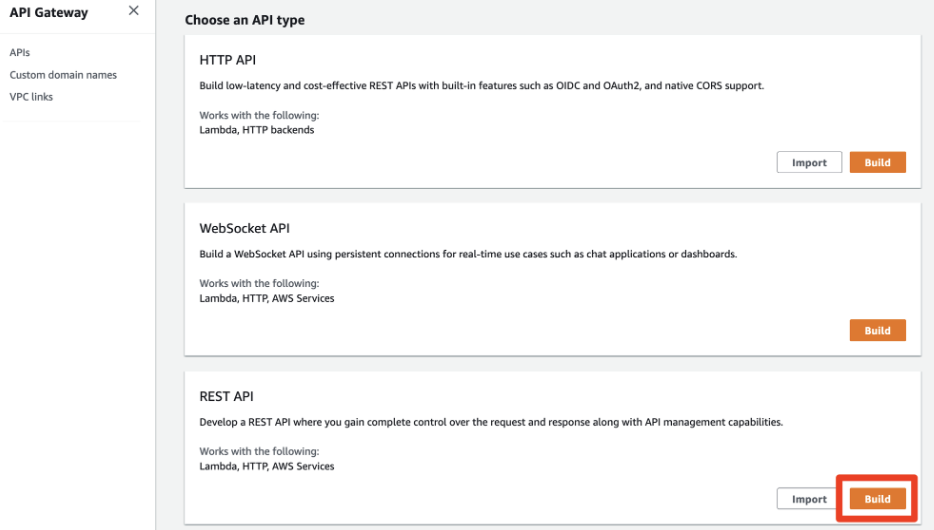
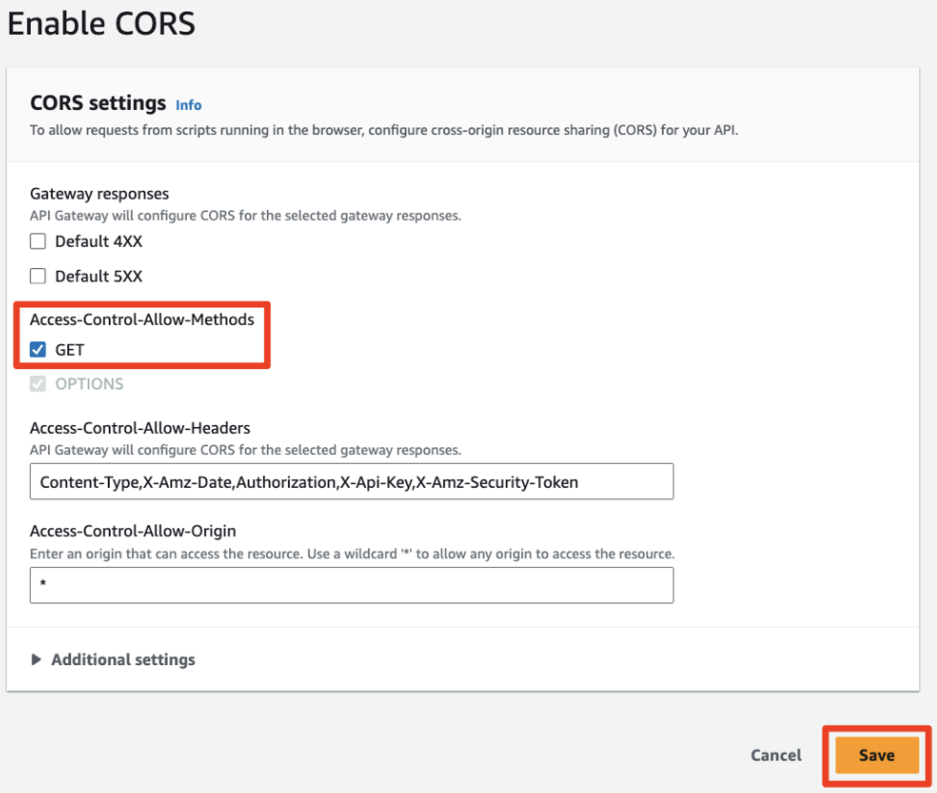
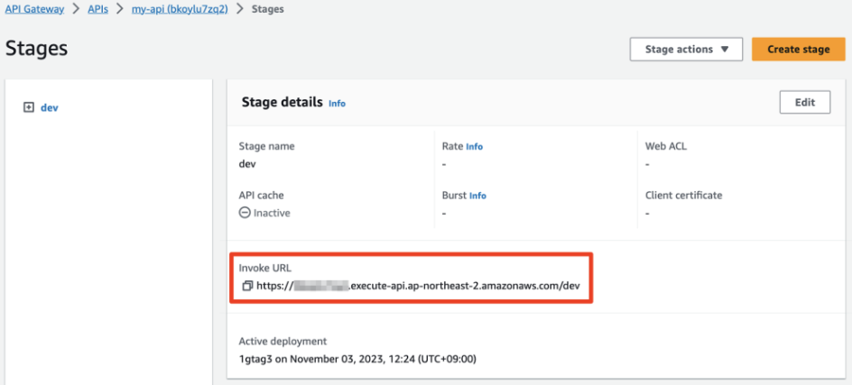
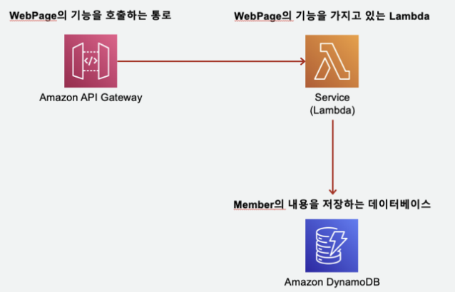
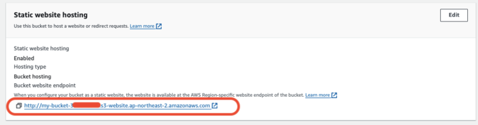
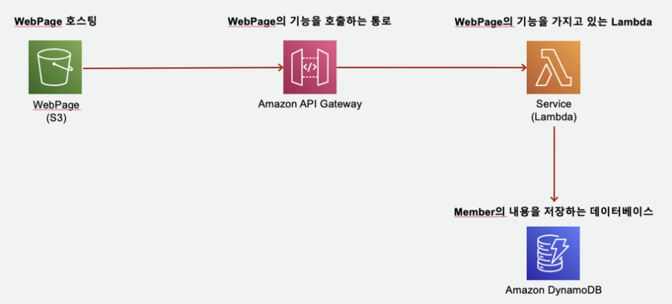

> 업무를 하다 보면 EC2, Lambda, 로드 밸런서, S3 등 다양한 AWS 시스템에 관한 이야기를 듣습니다. 들을 때마다 검색을 통해 얕은 지식을 얻을 수는 있었지만, 실제로 세팅을 해보고 싶었습니다.
>
> 주니어 개발자는 배포를 경험해 볼 기회가 적습니다. 그래서 만들고 싶었던 사이드 프로젝트를 개발하면서 배포를 경험해봐야겠다고 생각했습니다. 배포 관련 지식을 얻기 위해 검색하던 중 **2024 AWS Tech Camp** 소식을 접했고, 레벨100부터 레벨300까지 다양한 수준의 강의 및 실습을 진행한다는 것을 보고 신청했습니다. 각 세션은 3시간 정도씩 진행됩니다. 오늘은 금일 시행된 레벨100 강의를 정리해보겠습니다.

## **AWS 서버리스로 서버 고민 없이 웹 애플리케이션 구축하기 (레벨100)**

**AWS의 대표 서버리스 서비스인 Lambda를 토대로 AWS 기반 서버리스를 만들어보는 과정**입니다.

먼저 AWS 서비스에 대해 소개하고, 예제를 통한 실습으로 구축해보는 것을 목표로 합니다.

실습은 친구들의 기분 상태를 랜덤하게 매칭하는 코드를 AWS Lambda에 올리고, Lambda가 실행될 때마다 랜덤하게 생성된 친구 기분 상태 데이터를 DynamoDB에 저장합니다. 그리고 API Gateway로 인터넷 주소를 만들어 Lambda와 연결하는 과정입니다. 웹 페이지를 호스팅하기 위해 S3도 사용합니다.

요약하면, 생성된 주소로 접속했을 때 S3에서 제공하는 index.html에 버튼이 있고, 이 버튼을 클릭하면 Lambda 함수가 실행되어 DynamoDB에 데이터가 저장되는 방식으로 구현합니다.

먼저 첫 번째 세션에서 사용할 AWS 서비스 4가지를 다시 정리해보겠습니다.

### S3

- 대규모 데이터를 저장할 수 있는 스토리지입니다.
- HTML, CSS, JavaScript, 이미지 등 정적 파일을 저장하고 웹사이트로 제공할 수 있습니다.
- 데이터를 여러 물리적 시설에 복제하여 높은 가용성을 가지고 있습니다.

> 만약 React로 빌드된 결과물을 서빙하고 싶다면, S3에 index.html, index.js 파일 등을 업로드해 정적 웹 호스팅이 가능합니다. CloudFront까지 사용하면 더 좋겠죠.

### API Gateway

- HTTP APIs, WebSocket APIs, RESTful APIs를 손쉽게 생성, 배포, 관리할 수 있도록 합니다.
- 다양한 백엔드 서비스와 통신을 중계하고, 트래픽 관리, 인증 및 권한부여, 모니터링, API 버저닝 등 기능을 제공합니다.
- Oauth 2.0, AWS IAM 등 다양한 인증 방식을 지원하여 API 접근을 제한하고 보안을 강화할 수 있습니다.

> 애플리케이션의 대문 역할을 한다고 생각하면 됩니다.

### Lambda

- 서버 관리가 필요 없으며, 자동으로 스케일링이 이루어집니다.
- 고가용성이 보장되고, 보안에 대한 고민을 덜 수 있습니다.
- 사용한 만큼만 비용이 지불됩니다.
- Node.js, Python 등 코드를 업로드하기만 하면 됩니다.
- DB에서 데이터를 읽어오거나 저장하는 로직을 만들 수 있으며, 다른 서비스를 호출할 수도 있습니다.

> Lambda에는 장점만 있는 것은 아닙니다. 예를 들어, 대규모 트래픽이 지속적으로 발생하는 애플리케이션의 경우, EC2와 같은 전통적인 서버 기반 환경이 더 경제적일 수 있습니다.

### DynamoDB

- AWS에서 제공하는 **완전 관리형 NoSQL 데이터베이스 서비스**입니다.
- DynamoDB는 **키-값(key-value)** 및 **도큐먼트(document)** 저장소로 활용 가능합니다. 이를 통해 JSON, XML 등 다양한 데이터 구조를 저장하고 유연한 데이터 모델링을 할 수 있습니다.
- 관계형 데이터베이스와 달리, DynamoDB는 유연한 스키마를 제공하여 다양한 형태의 데이터 구조를 저장할 수 있습니다. 따라서 데이터 변화가 잦은 애플리케이션에 적합합니다.

> 가장 인상 깊었던 점은 **스키마 없이 자유로운 구조의 데이터를 저장할 수 있다는 것**이었습니다. MS SQL, MySQL을 사용해본 경험이 있는데, 이는 완전히 새로운 경험이었습니다.

위 내용은 강의 내용에 제가 부연 설명을 더해 정리한 것입니다. AWS 서비스에 대해 알아보았으니, 이제 본격적인 실습을 통해 직접 사용해볼 차례입니다.

## 실습

목표로 하는 최종 아키텍처는 아래 이미지와 같습니다.

> 자세한 순서는 [AWS에서 제공하는 실습 페이지](https://catalog.us-east-1.prod.workshops.aws/workshops/600420b7-5c4c-498f-9b80-bc7798963ba3/ko-KR/serverless)에서 확인할 수 있습니다.



### 1. 관리자 계정 만들기

먼저 root계정이 아니라 관리자 권한을 가지고 있는 사용자를 만듭니다.

> 이유를 찾아봤는데 보안과 안정성을 위해서였습니다. aws root계정은 모든 리소스와 설정을 변경할 수 있기 때문에 실수로 중요한 설정을 변경하거나 리소스를 삭제할 위험이 있기 때문입니다.

### 2. DynamoDB Table 생성하기

AWS콘솔에서 DynamoDB에 들어갑니다. 이 때 별을 눌러서 즐겨찾기를 해놓으면 위에 크롬북마크처럼 등록되서 다음에 찾아들어가기 쉽습니다.

> AWS 콘솔 특성상 여러 페이지를 왔다갔다하면서 사용하는 경우가 많아서 자주 사용하는 것들은 즐겨찾기 해놓는 것이 좋은 것 같습니다.

1. `create table` 로 새로운 테이블을 생성합니다.
2. table name과 partition key(기본키)를 입력합니다.
   table name은 ‘hello-member’로 입력하고,
   partition key는 앞으로 할 예제에서 사용할 key와 동일하게 입력합니다. (’name’ 입력)
3. 이렇게 생성하면 끝입니다! 리스트에서 status가 active될 때까지 가디려주기만 하면 끝입니다.

우리는 전체 아키텍처에서 DynamoDB테이블을 생성했습니다.



### 3. Lambda로 앱서버 생성하기

마찬가지로 Lambda도 AWS 콘솔에서 검색해 들어갑니다. 즐겨찾기도 해둡니다.

1. `Create a function` 으로 새로운 기능을 가진 서버를 추가합니다.
2. `Author from scratch` 를 선택합니다.

   > Lambda의 모든 설정을 처음부터 만드는 것입니다.

3. `Function name`에는 ‘api-service-create'를 입력하고, `Runtime`에는 ‘python 3.9’를 선택합니다.
4. `Permissions`를 직접 생성하겠습니다. `Execution role` 에서 **`Create a new role from AWS policy templates`** 를 선택합니다. `Role name`은 ‘my-lambda-role’을 입력합니다.
5. 아까 만든 DynamoDB와 연결해줍시다. 다른 AWS 서비스끼리 연결, 이용, 호출할 때에는 Permission에서 권한 작업을 해주어야 합니다. `Policy templates` 에서 **`Simple microservice permissions DynamoDB`** 를 선택합니다.
6. create function을 눌러 다음으로 이동합니다.
7. Code source 부분에 아래 코드를 복사 붙여넣기 한 뒤 `Deploy` 를 누릅니다.

   > 아래 코드는 멤버의 이름, 기분 상태를 랜덤으로 매핑시켜주고 DynamoDB에 저장하는 기능입니다.

   ```tsx
   import json
   import boto3
   import random
   import json

   def lambda_handler(event, context):

       member_name = ['Ama','Jone','Zon','Penny','Jessie']
       member_status = ['Happy','Sad','Serious','Satisfied','Free']

       dynamodb = boto3.resource('dynamodb',endpoint_url='http://dynamodb.ap-northeast-2.amazonaws.com')
       member_table = dynamodb.Table('hello-member')

       name = member_name[random.randint(0,4)]
       status = member_status[random.randint(0, 4)]

       member_table.put_item(
          Item={
               'name': name,
               'status': status,
           }
       )

       documents = {'name':name,'status':status}

       print(documents)

       return {
           'statusCode': 200,
           'headers': {'Access-Control-Allow-Origin': '*'},
           'body': json.dumps(documents)
       }
   ```

8. 이제 Test버튼을 누릅니다.
9. Configure test event에서 Event name에는 my-api-test를 입력하고, Template은 hello-world를 선택하고 save합니다.
10. 이제 Test버튼을 누르면 테스트가 진행됩니다.

    > 아래처럼 나오면 성공입니다.

    

자 이제 기능 구현은 끝났습니다. DynamoDB에 다시 들어가서 hello-member table을 클릭 후에 Explore table items를 클릭하면 데이터가 잘 들어간 것을 확인할 수 있습니다.

지금 아키텍처는 다음과 같습니다.



### 4. API Gateway 생성

앞에 만든 Lambda를 실행시키기 위해 API Gateway를 구성해서 호출 통로를 만들겠습니다.

마찬가지로 AWS 콘솔에서 검색해서 들어갑니다.

1. 우선 어떤 방식의 API를 만들지를 결정하는데 HTTP API 보다 API 관리 기능이 더 추가되어 있는 REST API로 생성하겠습니다.

   

2. API details에서 `New API`를 선택하고 `API name`을 ‘my-api’로 지정합니다. 그 다음 `create api`를 눌러줍니다.
3. 들어간 화면에서 우측하단에 있는 `Methods` 패널에서 `Create Method` 를 누릅니다. 이제 API를 구성할 수 있습니다. Method type은 ‘GET’으로 하고 `Integration type`은 `Lambda function`으로 하고 `Lambda Proxy integration Toggle`을 활성화 합니다. `Lambda function`에는 아까 Lambda에서 만들었던 function을 클릭합니다. Create Method 클릭!
4. Resources 리스트에서 GET에 들어가면 확인할 수 있습니다.

   > API Test도 바로 해볼 수 있습니다. 해당 API의 Test탭에서 할 수 있습니다. request body, headers 등에 값을 추가해서 test해볼 수 있습니다.

### 5. API Gateway 추가 설정

1. 바로 API를 호출하면 CORS에러가 뜨기 때문에 리스트에서 GET상위에 있는 ‘/’를 클릭해서 우측에 있는 `Enable CORS`를 클릭해줘야 합니다.
2. Access-Control-Allow-Methods 중에 GET을 클릭하고 Save해줍니다.

   

3. API 사용준비를 끝마쳤고 Deploy API를 누릅니다. 여기서 팝업 창이 뜨는데 Stage에는 New Stage를 선택하고 Stage name에는 dev를 입력하고 Deploy해줍니다.

   > Stage별로 API를 Deploy를 해줄 수 있습니다.

4. Deploy를 완료하면 Invoke URL이 나옵니다. 이 API로 저희는 호출해볼겁니다.

   

5. URL에 입력해보면 데이터가 화면에 나오는 것을 볼 수 있습니다.

우리는 여기까지 아래 아키텍처를 구성했습니다.



### S3 Bucket 생성하기

1. AWS 콘솔에서 S3를 검색하고 들어갑니다. buckets에서 `Create bucket`을 눌러주고 `Bucket name`에는 my-bucket-[random number]를 입력해줍니다.

   > 전세계에서 고유한 bucket이름이어야 합니다.

2. 우리는 지금 public으로 열어줄거기 때문에 Block all public accss 체크를 풀어줍니다. 그리고 아래에 이 사실을 인지했다는 워닝 부분에 체크도 해줍니다. (실습이기 때문에)
3. Create Bucket을 누르면 bucket생성은 끝났습니다.
4. 그 다음, 생성한 bucket을 리스트에서 들어가서 `Upload` > `Add files`를 눌러준 뒤에 위 api를 호출 하고 결과를 반환하는 버튼이 있는 index.html파일을 넣어줍니다.

### S3 정적 웹사이트 호스팅 기능 활성화하기

1. 생성한 Bucket에 `Properties`탭에 들어가서 화면 제일 아래 쪽에 `Static website hosting` 섹션을 확인합니다. `Edit`버튼을 누릅니다.
2. `Index document` 부분에 ‘index.html’을 입력합니다. `Save changes`를 해줍니다.
3. 위 설정이 완료되면 아래처럼 링크가 나옵니다.

   

4. 아직 외부에서 접근할 수 있는 접근 권한이 없어서 `Permissions` 탭에서 `Bucket policy`에 `Edit`을 눌러줍니다.

   아래 내용을 Bucket Policy 편집창에 붙여 넣습니다. 이 때 코드 상에 있는 [본인버킷번호]에 아까 랜덤으로 입력했던 버켓 번호를 입력합니다.

   > 모든 사람이 버켓에 접근해서 다운로드 할 수 있게 하겠다는 내용입니다.

   ```tsx
   {
     "Version": "2012-10-17",
     "Statement": [
       {
         "Sid": "Stmt1709405011428",
         "Action": [
           "s3:GetObject"
         ],
         "Effect": "Allow",
         "Resource": [
           "arn:aws:s3:::my-bucket-[본인버킷번호]",
           "arn:aws:s3:::my-bucket-[본인버킷번호]/*"
         ],
         "Principal": "*"
       }
     ]
   }
   ```

이제 모든 아키텍처를 완성했습니다.



## 후기

- 과거에 Github Actions를 이용해서 CI/CD를 구축하는 경험을 했었는데 이번에 AWS 서비스와 연동해서 내가 만들고 싶었던 프로젝트를 만들어야 생각을 했습니다. 프리티어 기간이 12개월이니까 그 안에 최대한 많은 실험을 해보고 싶어지더군요. (자세한 내용은 AWS에서 제공하고 있는 [프리티어 세부정보](https://aws.amazon.com/ko/free/?p=ft&z=subnav&loc=1&all-free-tier.sort-by=item.additionalFields.SortRank&all-free-tier.sort-order=asc&awsf.Free%20Tier%20Types=*all&awsf.Free%20Tier%20Categories=*all)에서 확인해보시는 것을 추천합니다.)
- 위 서버리스 아키텍처 구성뿐만 아니라 **EC2를 이용해서 웹 어플리케이션을 만드는 세션**도 현재 대부분 회사에서 EC2 서비스를 이용하고 있는 서비스에 대한 이해도를 높이는데 큰 도움이 되었습니다.
  VPC, CIDR, 서브넷, 라우팅 테이블, 보안그룹, AMI, 로드밸런서, 오토스케일링에 대한 기본개념을 습득할 수 있었고 실습을 통해 조금 더 높은 이해로 아키텍처를 해석할 수 있었습니다.
  앞으로 회사에서 Backend 및 DevOps와 소통할 때 좀 더 원활한 대화가 가능할 것 같습니다.
- 프론트, 백엔드 구분없이 누구나 AWS 서비스에 대한 이해가 적은 상황이라면 AWS Tech Camp 다시보기를 통해 기본 지식을 습득하는 것이 좋은 것 같습니다. 만약 이해도가 이미 조금 있는 상황이라면 Level200, Level300 세션도 운영하고 있으니 들어보고 필요하면 회사에 도입해보는 것도 좋은 것 같습니다.
