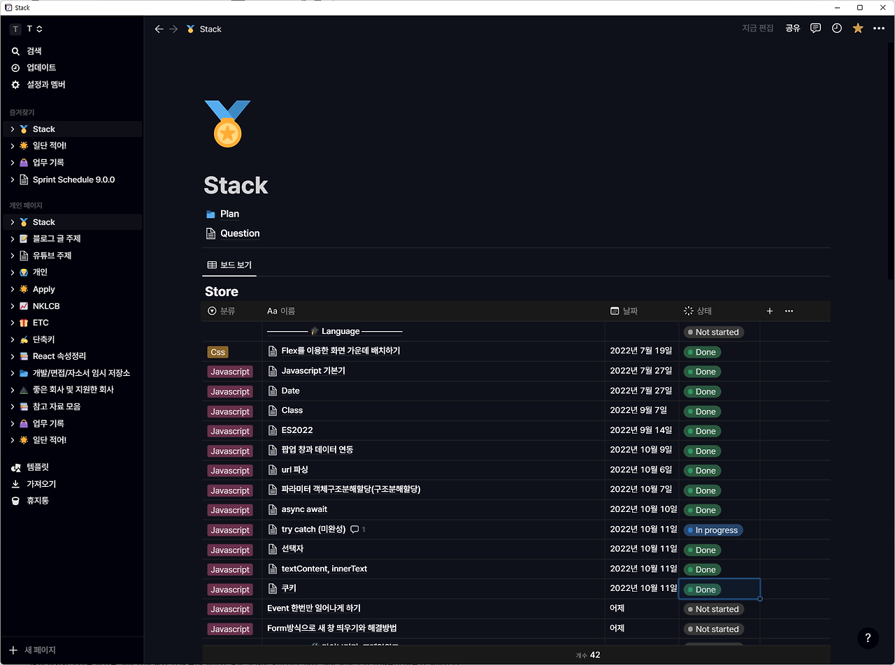

> **이 글을 쓰는 이유  
> **함께 일하고 있는 동료 중 많은 이슈가 주어졌을 때 우선순위를 정하지 못하거나 중요한 항목을 챙기지 못하는 경우들을 보고 이런 경우 나의 경험이 도움이 될 수 있겠다고 판단이 되어 작성하였습니다.

나는 Jira로 팀 스프린트를 관리하고 Notion으로 개인적인 스프린트를 관리한다.

"굳이 Notion으로 개인적인 스프린트를 관리하는 이유가 뭐지? Jira와 Notion 2중 관리해야 돼서 더 번거로워지는 것이 아닌가?"라고 물음을 던질 수 있다. 하지만, 복잡성이 높은 이슈가 주어졌을수록 이런 관리법은 힘을 발휘한다. 어떤 힘을 발휘할까?

## CheckList

현재 재직하고 있는 회사는 개발 후에 짧은 시간 동안 개발자 검증 기간이 주어진다. 아마 개발 중에 놓친 사항들이 없는지 개발자 본인이 더 찾기 쉬울 것이기 때문에 시행할 확률이 높다. 이때 개발 누락된 것이 없는지 QA에서 체크리스트를 작성해주고 개발자가 직접 확인하며 체크한다.

만약, 이런 체크리스트가 주어지지 않는다면 개발자 본인이 빼먹은 개발항목이 없는지 직접 다시 기획서를 보면서 확인해야 한다.  
노션으로 각 이슈들을 관리하면 이 이슈를 해결하기 위해 개발적으로 어떤 일들을 수행해야 하는지 시작하기 전에 기획서를 보면서 미리 정리하여 머릿속을 정리할 수 있고 우선순위도 정할 수 있으며 개발하면서 혹시 빼먹고 넘어갈 수 있는 부분들을 사전에 방지할 수 있다. 물론 이 체크리스트는 개발하면서 수시로 바뀐다. 바뀌어도 괜찮다. 빼먹지 않는 것이 중요하다. 이 방법은 우아한테크코스를 진행하면서 배운 방법이었다. 방법이 궁금하다면 깃헙에 우아한테크코스 과제를 찾아본다면 경험해 볼 수 있다. 체크박스를 써보자.

## Question

개발하다보면 이것저것 궁금한 것들이 생기기 마련이다. 그런데, 만약 일정에 쫓기고 있거나 당장 물어보거나 찾기 어려운 상황이라면 "나중에 물어봐야지!/알아봐야지!" 해놓고 까먹기 십상이다. 그런 것들을 정리해두면 급한 불들을 끄고 나서 뒤늦게 확인하고 놓치지 않을 수 있다. 보통 개발 기술에 대해 궁금증이었다면 시간이 지나면 비슷한 상황을 또 만나게 되고 그때 또 궁금증이 생기게 된다. 근데, 또 그때 시간이 나지 않아서 알아볼 시간이 없다면 다음에 또 같은 상황을 반복하는 것이다.  
궁금한 것이 생기면 바로 푸는 것이 좋다. 하지만 그럴 여건이 되지 않는다면 정리할 수 있다.

## Develop

이번 스프린트 때 어떤 개발을 내가 했는지 정리해둘 수 있다. 내가 개발한 것들을 정리해두면 개인적으로도 좋고 인정받기도 좋다. 개인적으로는 내가 어떤 개발을 했고 어떤 것을 배웠는지 회고의 시간을 가질 수 있다. 혹여 시간이 지나 그 이슈를 봤을 때 더 좋은 아이디어가 떠올라서 더 나은 방향으로 개발할 수도 있다. 이렇게 개인적으로도 좋지만 회사에 주요업무 실적보고를 해야 할 때 내가 어떤 일들을 했는지 한눈에 확인하고 보고할 수 있다.

## Notice

나는 기억력이 그렇게 좋지 않다. 이번 스프린트 때 특히 더 신경써야 하는 부분들이 회의에서 안건으로 나왔다면 나만의 공지사항처럼 제일 위에 써놓는다. 그러면 스프린트를 관리하러 노션에 들어갈 때마다 확인하게 되고 아무리 바빠도 빼먹지 않게 된다.

## Schedule

해당 스프린트 글에서 제일 아래 스케쥴을 위한 달력을 만들어 놓는다. 이렇게 하면 이번 스프린트에서 챙겨야 할 회의, 일정에 대해 빠지지 않고 체크할 수 있게 된다. 이렇게 정리해두면 "그 일정이 언제까지였더라..?"라고 하면서 팀 단톡방을 다시 찾아보거나 하면서 시간낭비를 하는 일이 없어진다.

> 여기까지 스프린트를 어떻게 관리하고 있는지 이론적으로 설명했다. 아래부터는 사진이랑 같이 보면서 좀 더 직관적으로 느낌을 전달하고자 한다.

---

## 스프린트 탬플릿을 이용한 스프린트 관리

스프린트마다 notion page를 만들어서 관리한다. 만들 때마다 세로 세팅하는 것은 매우 번거로운 일이기 때문에 아래처럼 템플릿을 하나 만들어놓고 스프린트 시작할 때마다 복사해서 사용하면 편하다.

[##_Image|kage@dxPYis/btrPhp4miru/aOS9KVZGGi1nHj5jMWkylk/img.png|CDM|1.3|{"originWidth":310,"originHeight":251,"style":"alignCenter","caption":"정리한 스프린트들"}_##]

## 공지사항급으로 관리해야 할 항목이나 링크들 관리

이번 스프린트를 진행하면서 반드시 알아두거나 신경 써야 할 것들을 페이지 최상단에 간단하게 정리해둔다. 필요시 빠른 이동을 위한 링크들도 정리해둔다. 이 부분들이 많은 범위를 차지하면 아래 이슈들을 정리할 때 매번 스크롤을 내려야 하기 때문에 콜아웃안에 정리해뒀다.

[##_Image|kage@ArNUQ/btrPfD3MEjC/xzYRXFwQV6UX1De4HzK1mK/img.png|CDM|1.3|{"originWidth":1083,"originHeight":402,"style":"alignLeft","caption":"공지 및 바로 확인할 수 있게끔 링크걸어놓은 페이지들"}_##]

## 진행상황 관리

공지사항부분 바로 아래는 노션으로 칸반 보드를 만들어서 관리한다. 노출되는 부분의 구성은 이렇다.

-   이슈 제목
-   함께 작업한 사람
-   머지 여부
-   완료 여부

함께 작업한 사람의 경우 나중에 시간이 지나서 해당 이슈로 인해 사이드가 나는 등 이력을 확인해야 할 때를 위해 적어 놓는다. 보통 백엔드 개발자를 적는 경우가 많다. 머지 여부는 굉장히 많은 이슈가 주어져서 작업하다가 PR만 올려놓고 머지를 안 했을 때다. 물론 머지 권한이 나에게 없으면 괜찮지만 나에게 머지 권한이 있는 경우 이렇게 해두면 어떤 것을 dv환경에 소스 반영하지 않았는지 알기 쉽다. 완료 여부는 머지를 했더라도 다른 연관부서에서 추가 작업을 통한 뒤 내가 이어서 작업을 해야 한다던지 할 때 완료되지 않음으로 표시해두고 놓치지 않게 한다. ("이 경우 \[완료\] 부분으로 안 옮기면 머지 \[Y\] 표시했더라도 아직 진행 중이라는 것을 알 수 있지 않나요?"라고 반문할 수 있지만 동시에 이슈가 10개 있고 비슷한 이슈들도 있다고 하면 충분히 놓칠 수 있는 상황이 벌어진다.)

[##_Image|kage@cdvIYX/btrPfOj0OVn/m4gh6GvgBoQzcnkUQR2Dfk/img.png|CDM|1.3|{"originWidth":1099,"originHeight":306,"style":"alignLeft"}_##]

## 체크리스트

이슈 속으로 들어가보면 아래와 같이 정리해둔다. 물론 체크박스로!

정리하면서 "이런 식으로 구현하면 좋겠다!" 싶으면 바로 PseudoCode로도 작성해둔다.

[##_Image|kage@b58Wlh/btrPg13Mc45/qdnI8vP2kgoZ56dqpoD9tk/img.png|CDM|1.3|{"originWidth":1076,"originHeight":512,"style":"widthContent","caption":"내가 썼던 내용들을 이미지로 쓰려니.. 회사 내부적인 정보들이 들어가있는 것이 많아서 차마 붙이지 못했다."}_##]

## 일정 관리

아래와 같이 항목과 시간을 같이 표시해두면 회고나 기타 회의들에 빼먹지 않고 참가할 수 있다. 바쁘다 보면 챙기지 못할 수 있기 때문에 이런 습관은 회의에 늦지 않게 참가할 수 있게 해 주고 주위 사람들의 신용을 살 수도 있다.

[##_Image|kage@R0hHl/btrPg0jvxZ3/XJ5ekkMMZAqi5Mwm9lnZe1/img.png|CDM|1.3|{"originWidth":912,"originHeight":1070,"style":"widthContent"}_##]

---

## 번외 | 노션 좀 더 모던하게 사용하기

나같이 노션의 한정적인 테마 때문에 사용하기 지겨운 사람들이 충분히 있을꺼라고 생각한다.

그래서 나는 Notion Enhancer를 사용한다. Notion Enhancer를 이용하면 여러 가지를 커스텀해서 사용할 수 있다. (썸네일처럼 모던한 노션을 만들 수 있다!) 단, 내가 작성한 양이 많으면 페이지를 이동할 때 사이드바가 나오고 들어가는 속도가 조금 느려질 수 있다. 개인적으로 사용에 큰 영향을 주는 정도는 아니라고 생각한다. 하지만, 그럼에도 글을 쓸 때 즐거워지기 때문에 감안하고 쓴다. (빠르게 후다닥 장성해야 할 때는 웹으로 킨다. 그게 제일 빠르다.)

## 후기 | 개발 실력도 중요하지만 일정도 중요하다.

일정을 맞추지 못하면 누군가가 피해보게 된다. 고객의 VOC를 제때 처리하지 못하면 고객을 잃게 되고 나 다음 개발을 이어서 개발을 해야 하는 동료가 있을 경우 내가 대부분의 일정을 차지하게 되면 동료가 일을 하지 못한다. 일정을 지키는 것은 개발실력 못지않게 중요한 것 같다. 이 글을 통해 일정 관리에 어려움을 겪고 있는 동료에게 도움이 되었으면 좋겠다.