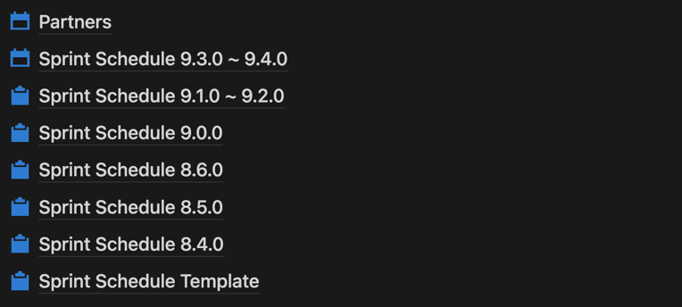
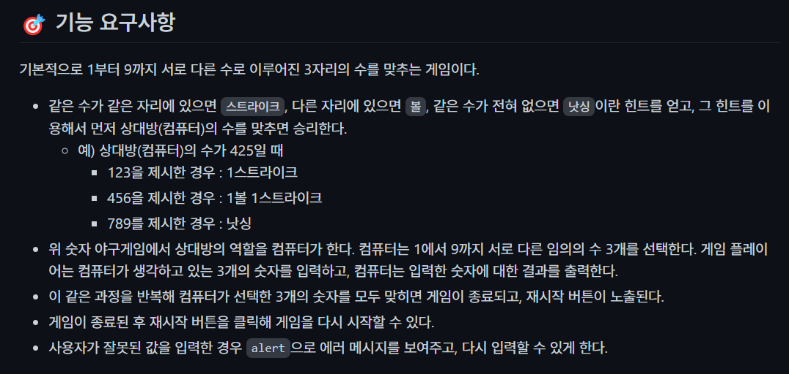
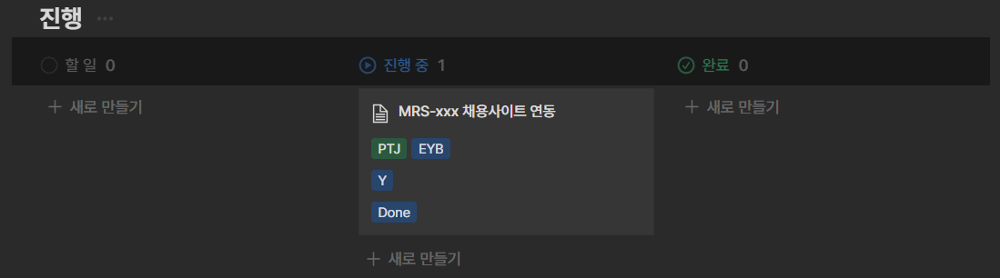
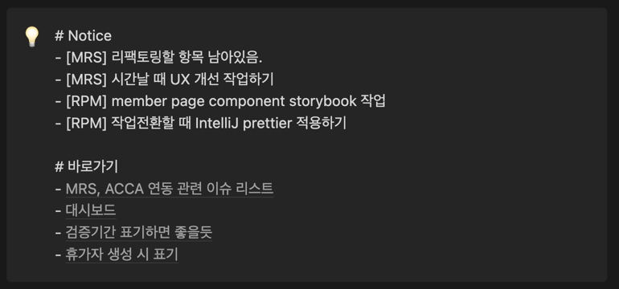
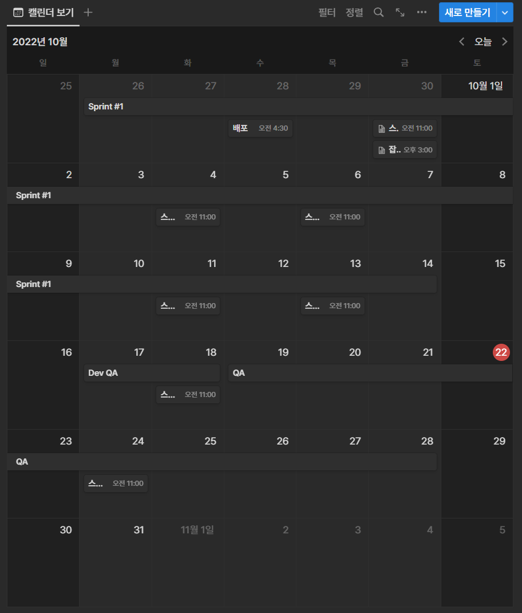

> 업무를 진행하면서 동시 다발적으로 많은 업무를 처리하게 될 경우는 반드시 찾아온다. 이 때 우선순위를 정하지 못하거나 중요한 항목을 챙기지 못하는 경우들을 보고, 나의 경험이 도움이 될 수 있겠다고 판단하여 이 글을 썼다. 이 글이 동일한 상황을 겪고 있는 사람들에게 도움이 되기를 바라는 마음이다.

나는 Jira로 팀 스프린트를 관리하고 Notion으로 개인적인 스프린트를 관리한다.

"굳이 Notion으로 개인적인 스프린트를 관리하는 이유가 뭐지? Jira와 Notion 2중 관리해야 돼서 더 번거로워지는 것이 아닌가?"라고 물음을 던질 수 있다. 하지만, 복잡성이 높은 이슈가 주어졌을수록 이런 관리법은 힘을 발휘한다. 어떻게 관리하는지 알아보자.

## 개발 시작 전 스프린트 페이지를 만들고 투두리스트 작성하기.

나는 개발 시작 전에 Notion 혹은 Jira에 이번 스프린트에 해당하는 페이지를 만들고 투두리스트를 작성하고 시작한다. 

아래 사진처럼 템플릿을 하나 만들고, 매 스프린트 때마다 복사하면서 사용한 사진이다. 만들 때마다 새로 새팅하는 번거롭기 때문에 하나 만들어두고 복사하면서 사용하자.

투두리스트는 정성들여서 상세하게 작성한다.

이 것을 작성하는 시간이 빈틈없는 개발을 진행하게 해주고, 결과적으로는 퀄리티를 높이고 시간을 더 아끼게 만들어주는 지름길 역할을 한다. 개발 뿐 아니라 기획에도 상당한 기여를 할 수 있음을 알게 된다.

물론, 모든 경우에 사용하지는 않는다. 기획이 거의 나오지 않은 상태에서 선 개발을 시작하면서 빈틈을 매꾸는 경우나 내가 경험해보지 못한 미지의 영역을 선작업 해야되는 경우같이 일단 작업하면서 내가 해야 될 일을 선명하게 만들어야 되는 경우도 있다. 이 때는 일단 개발을 시작한다.

이 방법은 아래 사진처럼 우아한테크코스 과제를 진행하면서 배운 방법이었다. 투두리스트를 막상 상세하게 작성해보려고 하면 쉽지 않다는 것을 알 수 있다. 이 것도 머리를 정리하는데 하나의 스킬이 된다.

## 개발 진행 관리

공지사항부분 바로 아래는 노션으로 칸반 보드를 만들어서 관리한다. 노출되는 부분의 구성은 이렇다.

- 이슈 제목
- 함께 작업한 사람
- 머지 여부
- 완료 여부 

함께 작업한 사람을 넣는 이유는 일단 프론트, 백엔드 인원을 합쳐서 10명 정도 되는 상황에서 여러 이슈를 동시 다발적으로 진행하게 되었을 때 나중에 추적하기 쉽기 때문이다.

머지 여부는 빈틈없이 내 소스를 origin에 올렸음을 기록하기 위해 체크한다.

완료 여부는 소스 머지를 했더라도 해당 이슈가 최종 완료가 되었는지를 확인하는 단계다. 다른 연관부서에서 추가 작업을 통한 뒤 내가 이어서 작업을 해야 한다던지 할 때 완료되지 않음으로 표시해두고 놓치지 않게 한다. 

이슈가 1개, 2개 일 때는 큰 효과가 없다. 많은 갯수를 병렬적으로 진행할 때 효과를 발휘한다. 

## 개발 진행과정에서 생기는 기술부채.

개발하다보면 일정에 쫓겨서 빠르게 개발을 해야 되는 경우가 있다. 혹은 VOC가 들어와서 당장 해결해야 되는 경우들이 생긴다.

이 때 기술 하나하나에 대해 깊숙히 공부하면서 개발을 진행한다면, 서비스의 퀄리티는 올라갈 수 있지만 진척 속도가 늦어진다.

이럴 때는 어느정도의 기술부채가 생기는 것을 감안해야 한다. 이 때 포인트는 우리의 머리는 문제를 해결하고 넘어갔을 때 완전히 내 것이 되었다고 기억을 할 것이기 때문에 추가 적인 학습이 필요한 부분이라면 기록해두고 다음에 찾아봐서 성장의 밑거름으로 이용해야 한다는 점이다.

시간이 지났을 때 우리는 비슷한 상황들을 만날 확률이 높다. 만약, 지난 번의 경험으로 성장하지 못했다면 이번에도 저번과 비슷한 시간을 사용해야만 할 것이다.

물론, 궁금한 것이 간단하다면 바로 푸는 것이 좋다. 하지만 그럴 여건이 되지 않는 상황이라면 다음에 챙길 수 있도록 기록하자.

## 개발하면서 생기는 코드 컨벤션 등 규칙들

이번 스프린트 때 특히 더 신경써야 하는 부분들이 회의에서 안건으로 나왔다면 나만의 공지사항처럼 스프린트 관리 글 제일 위에 써놓는다. 그러면 스프린트를 관리하러 노션에 들어갈 때마다 확인하게 되고 아무리 바빠도 빼먹지 않게 된다.

이 부분을 챙기는 이유가 중요한 이유는 한 사람, 한 사람이 이런 안건을 공통적으로 적용하자고 건의 했을 때 따르는 사람과 따르지 않는 사람이 보통 구별이 되는데 따르지 않는 사람의 코드는 시간이 지날수록 PR 때마다 여러사람이 더 신경써서 보게 되고, 이는 그 사람의 신용도와 직결되며 많은 사람들의 리소스를 할애해야만 하는 경우가 생길 수 있기 때문이다.

## 개발 후에 기록하는 습관

이번 스프린트 때 어떤 개발 범위를 내가 직접 했는지 정리하자.
이렇게 정리해두면 여러 장점이 있다.

- 정리하면서 리팩토링 하고 싶었던 부분을 발견할 수 있고, 코드 퀄리티를 올려 DX에 기여할 수 있다.
- 기술 부채로 쌓아놨던 부분을 떠올릴 수 있다.
- 내가 성장한 부분, 부족한 부분을 가려낼 수 있다.

마무리를 잘하는 것도 중요하다.

## 스프린트에 관련된 스케쥴 관리

해당 스프린트 글에서 제일 아래 스케쥴을 위한 달력을 만들어 놓는다. 이렇게 하면 이번 스프린트에서 챙겨야 할 회의, 일정에 대해 빠지지 않고 체크할 수 있게 된다. 이렇게 정리해두면 "그 일정이 언제까지였더라..?"라고 하면서 팀 단톡방을 다시 찾아보거나 하면서 시간낭비를 하는 일이 없어진다. 이런 작은 디테일들에서 시간을 아낄 수도 있고, 바쁜 일정 중에서 회의를 놓치는 일도 없어진다.

## 후기 | 개발 실력도 중요하지만 일정도 중요하다.

일정을 맞추지 못하면 누군가는 피해보게 된다. 고객의 VOC를 제때 처리하지 못하면 고객을 잃게 되고 개발을 제때 끝내지 못하면 이어서 개발을 해야 하는 동료가 있을 경우 동료 일정에 문제가 생길 수 있다. 일정을 지키는 것은 기본적인 신뢰를 쌓을 수 있게 해준다. 이 글을 통해 다양한 어려움을 겪고 있는 미래의 동료들에게 도움이 되었으면 좋겠다.
