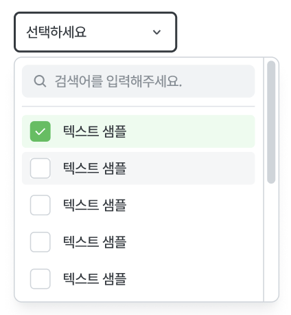

> 10년이 넘은 레거시 프로젝트의 경우, 작은 부분을 유지보수하는 데도 많은 시간이 소요되었습니다. 그래서 일부씩 리뉴얼하기 위해 입사 후 지속적으로 시도했으며, 작년부터는 조금씩 리뉴얼 작업을 시작할 수 있었습니다. 소규모 리뉴얼 시에는 즉흥적으로 컴포넌트를 만들어 사용하면 되었지만, 여러 팀이 합쳐져 대규모 리뉴얼을 진행할 시점에는 기획자, 디자이너, 개발자 등 30명이 사용할 디자인 시스템 개발이 필요했습니다. 이 포스팅은 디자인 시스템을 개발하고, 반년 이상 고도화시키면서 겪은 경험을 기록한 것입니다.

## 문제와 해결방안

본격적인 개발에 앞서, 기본적인 문제를 정의하고 해결 방법을 모색합니다.

- **기존 디자인과의 조화**
  - **문제 정의**
    리뉴얼 시, 유저들의 VOC와 니즈를 파악하여 새로운 기능을 추가하게 됩니다. 이때 기존 서비스와 의존성이 있는 부분들이 있어, 해당 부분은 기존 디자인을 유지해야 하는 문제가 존재했습니다.
  - **해결 방법**
    우선 기존 디자인을 전부 파악합니다. 예를 들어, 버튼만 해도 수십 가지 형태로 사용되고 있었습니다. 이를 패턴화하고 정형화시켰습니다. 이제 기존 디자인과 신규 디자인 모두를 사용할 수 있는 디자인 시스템이 완성되었습니다.
- **서비스마다 다른 메인 컬러**
  - **문제 정의**
    초록색을 메인 컬러로 사용하는 프로젝트와 파란색을 메인 컬러로 사용하는 프로젝트가 있었습니다. 따라서 프로젝트 단위로 메인 컬러를 구분하는 것이 필요했습니다.
  - **해결 방법**
    emotion의 ThemeProvider를 사용하여 프로젝트별로 Root에서 메인 컬러를 지정합니다. 이제 디자인 시스템 컴포넌트에 직접 색상을 주입하지 않아도, 바로 메인 컬러를 사용할 수 있게 되었습니다.
- **디자인 시스템 고도화**
  - **문제 정의**
    앞으로의 리뉴얼 프로젝트에서도 디자인 시스템을 사용해야 했습니다. 따라서 디자인 시스템은 지속적으로 고도화되어야 했습니다. 모듈을 따로 분리해 npm에 등록하면 유지보수 속도가 저하될 위험이 있었습니다. 주어진 시간은 매우 부족했습니다.
  - **해결 방법**
    우선 모노레포 구조를 만들고, 나중에 별도로 분리할 수 있도록 root/apps에 넣지 않고 root/packages로 디자인 시스템을 분리했습니다.

## 기술 스택

- **React**
  디자인 시스템은 컴포넌트를 재활용할 수 있도록 기본적으로 React를 사용해서 만들었습니다.
  이때 SSR 환경에서 정상적으로 동작하지 않는 것을 방지하기 위해 useLayoutEffect를 사용하지 않았습니다. useEffect를 사용하는데 SSR과 CSR의 초기 렌더링 차이가 발생하지 않도록 렌더링과 관련된 로직에 문제가 없도록 신경써서 개발했습니다.
- **TailwindCSS**
  스타일 도구로는 TailwindCSS를 선택했습니다. 모든 환경에 구애받지 않는 점이 가장 큰 이유였습니다. TailwindCSS는 빌드 시 index.css 파일로 분리되고, 런타임 환경에서 DOM Tree와 CSSOM이 매칭될 때 클래스들만 있으면 됩니다. 따라서 각 프로젝트에서는 해당 index.css 파일만 불러오면 됩니다.

## 컴포넌트 설계 기조

컴포넌트를 설계할 때의 기조는 다음과 같습니다.

- 기능적인 부분은 각 사용처의 성격에 맞게 다르게 사용할 수 있도록 최대한 내장하지 않고, 디자인에 집중합니다.
- 처음부터 오버엔지니어링하여 모든 경우의 수를 고려하려 하지 않고, 기본적인 형태를 제공하며, 이후 여러 프로젝트에서 동일한 형태가 필요할 때 고도화합니다.
- 조립해서 사용해야 하는 컴포넌트의 경우, 합성 컴포넌트를 사용하여 사용처에서 조합하여 사용할 수 있게 합니다.
- 모든 속성을 열어줘야 하는 HTML Tag를 사용하지 않는 한, 제한적으로 props를 열어줌으로써 디자인 시스템 내부를 확인하지 않고 IDE의 도움을 받아 직관적으로 props를 사용할 수 있게 합니다.

## 컴포넌트 개발

대표적인 컴포넌트를 몇 가지 살펴보겠습니다.

### Dropdown

Dropdown은 매우 다양한 사용 사례가 존재합니다. 따라서 우리는 다양한 상황에 대응할 수 있도록 개발해야 합니다.

|  |  |     |  |  |
| ------------------------------------------- | ------------------------------------------- | --- | ------------------------------------------- | ------------------------------------------- |

위와 같이 다양한 상황에 대처하기 위해 Dropdown을 아래와 같이 나누었습니다.

DropdownButtonItem, DropdownCheckItem, DropdownRadioItem처럼 뒤에 Item이라는 접미사를 붙여 리스트의 아이템이라는 것을 직관적으로 이해할 수 있도록 했습니다.

```
📦Dropdown
 ┣ 📂DropdownBody
 ┃ ┣ 📜DropdownBody.tsx
 ┃ ┗ 📜dropdownbody.style.ts
 ┣ 📂DropdownButtonItem
 ┃ ┣ 📜DropdownButtonItem.tsx
 ┃ ┗ 📜dropdownButtonItem.style.ts
 ┣ 📂DropdownCheckItem
 ┃ ┣ 📜DropdownCheckItem.tsx
 ┃ ┗ 📜dropdownCheckItem.style.ts
 ┣ 📂DropdownRadio
 ┃ ┣ 📜DropdownRadioGroup.tsx
 ┃ ┣ 📜DropdownRadioItem.tsx
 ┃ ┗ 📜dropdownRadioItem.style.ts
 ┣ 📂DropdownScroll
 ┃ ┣ 📜DropdownScroll.tsx
 ┃ ┗ 📜dropdownScroll.style.ts
 ┣ 📂DropdownSeparate
 ┃ ┗ 📜DropdownSeparate.tsx
 ┣ 📂DropdownSubList
 ┃ ┗ 📜DropdownSubList.tsx
 ┣ 📂DropdownTextField
 ┃ ┗ 📜DropdownTextField.tsx
 ┣ 📂DropdownTrigger
 ┃ ┗ 📜DropdownTrigger.tsx
 ┣ 📜DropdownContainer.tsx
 ┣ 📜dropdown.constant.ts
 ┣ 📜dropdown.test.tsx
 ┣ 📜dropdown.type.ts
 ┗ 📜index.tsx
```

각 컴포넌트의 역할을 설명하겠습니다.  
(가독성을 위해 반복되는 접두사 "Dropdown"은 생략하겠습니다.)

- Body
  - Trigger를 클릭했을 때 나타나는 본체 부분입니다.
  - 렌더링 방향(위 또는 아래)을 결정하기 위해 내부적으로 상태를 가집니다.
  - useEffect 훅을 사용하여 Body가 화면 하단에 도달하면 위쪽으로 출력되도록 합니다.
- ButtonItem, CheckItem, RadioItem
  디자인 시스템의 최종 원자 컴포넌트들(Button, Checkbox, Radio)을 기본적으로 사용하며, 그 위에 Dropdown 전용 스타일을 적용합니다.
- Scroll
  Body 내부에 스크롤을 만들고 싶을 때 사용합니다. 디자인 시스템에 Scroll 컴포넌트가 있지만, 합성 컴포넌트용 Scroll을 만든 이유는 최적화된 스타일을 갖추기 위함과 내부에 ul 태그로 감싸기 위함입니다.
- Separate
  Body 내부에 여러 개의 분리선을 만들고 싶을 때 사용할 수 있도록 별도로 만들어두었습니다.
- SubList
  - Dropdown SubList는 props로 객체 형태의 여러 요소를 가진 배열을 받을 수 있습니다. 각 객체의 childrenList에 들어 있는 동일한 구조의 데이터는 각 항목에 마우스를 hover했을 때 우측 또는 좌측에 나타나는 리스트가 됩니다. hover 시 내부적으로 자기 자신인 Dropdown SubList 컴포넌트를 다시 렌더링하는 방식으로 구현했습니다.
  - 각 항목에 hover했을 경우, 해당 위치 오른쪽(또는 왼쪽)에 childrenList가 뜨게 하는 것이 핵심입니다. 더 이상 childrenList가 없는 요소일 경우 클릭이 가능하도록 구현했습니다.
- TextField, Trigger
  이 컴포넌트들도 디자인 시스템에 있는 TextField와 Button 컴포넌트를 그대로 가져와 스타일만 변경한 것입니다.

대표적으로 Dropdown을 설명드렸는데, 위와 같이 구성했을 때 모든 상황에 대응할 수 있었습니다. SubList의 경우 처음에는 없었고, Dropdown에 또 다른 Dropdown이 나타나야 하는 상황에서 개발한 것입니다.

### Dropdown 외에 다른 컴포넌트

- Alert, Modal: 합성 컴포넌트를 사용하여 개발한 덕분에 다양한 상황에 대응할 수 있었습니다.
- PortalTooltip: PortalTooltip 컴포넌트를 만들었는데, targetElement만 props로 지정하면 해당 DOM 요소를 기준으로 Tooltip이 나타납니다. 또한, arrowXOffset, tooltipXOffset, tooltipYOffset 같은 옵션들을 제공하여 Tooltip 위치를 세밀하게 조정할 수 있습니다.
- Scroll: Scroll 라이브러리를 이용하여 기본 동작을 가져오고, 시스템 요구사항을 충족하기 위해 커스터마이징을 시도했으며, 성공했습니다.
- 기타 컴포넌트들: 웹 접근성에서 사용자 경험 부분을 개선하려고 노력했습니다. 예를 들어, Checkbox의 경우 체크박스와 텍스트 사이의 공백을 클릭하면 클릭이 인식되지 않을 수 있는데, 이를 해결하기 위해 label로 감싸고 input과 span을 사용하면 빈틈없이 클릭을 인지할 수 있습니다.

## 후기

- “어떻게 해야 동료 개발자가 편리하게 디자인 시스템을 사용할 수 있을까?”를 매일 고민했습니다. 그 결과, 필수적인 기능과 디자인을 제공하면서도 자유롭게 커스터마이즈할 수 있는 디자인 시스템을 만들었습니다.
- 아무리 쉽게 만들더라도, 학습 단계를 완전히 건너뛸 수는 없다고 생각했습니다. 바로 예시를 보는 것이 이해에 도움이 될 것이라 판단해, 스토리북을 신경써서 개발했습니다.
- 시간이 부족해도 디자인 시스템에는 반드시 신경 써서 테스트 코드를 작성해야겠다고 생각했고, 이를 실천했습니다. 디자인 시스템이 무너지고 안정감을 잃으면, 그 영향은 모든 시스템에 미치기 때문입니다.
- 디자인 시스템은 나 혼자 만들어가는 것이 아님을 이해해야 합니다. 현재(2024년 9월 2일)까지 많은 기획자, 디자이너, 프론트엔드 개발자 동료들이 꾸준히 개선 사항을 건의해 준 덕분에 완성도가 높아지고 있습니다. 다양한 의견을 듣고 열린 마음으로 한 번 더 고민해보는 시간이 많은 도움이 되었습니다. 실제로 피드백을 듣고 좋은 생각 같다는 결론에 즉각 기능 고도화를 시켜 ~~최고의 개발자라는 칭찬을 받기도 했습니다. 매우 쑥쓰..~~
- 가장 좋았던 것은 서비스 검증 단계에서 디자인을 확인하고 수정하는 시간이 크게 줄었다는 점입니다. 디자인 시스템 개발 단계에서 디자인 검수가 모두 끝났기 때문에, 핵심 부분에 좀 더 집중할 수 있었고, 이는 서비스 품질 향상에 크게 기여했습니다.

결과적으로 좋은 경험이었습니다.

앞으로도 꾸준히 디자인 시스템을 고도화해서 토스처럼 많은 개발자에게 영향을 끼칠 수 있는 개발자가 되고 싶습니다.
