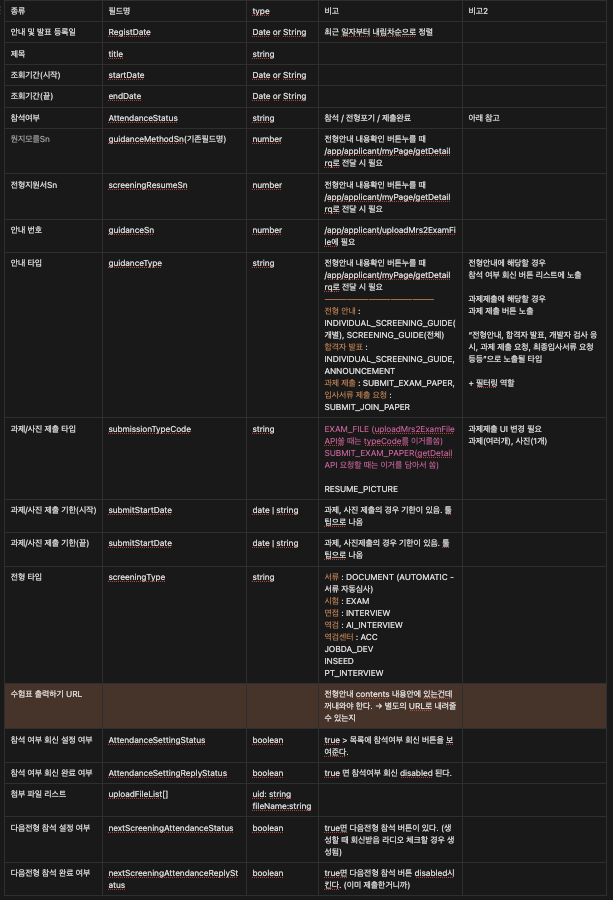

> 구직자가 지원한 공고 관련 내용들을 추적할 수 있는 마이페이지를 리뉴얼하고 있다.
백엔드 공수가 부족해서, 구API들을 파악하며 API 명세를 간단하게 짜는 방법을 정리했다.
나와 같은 상황에 놓인 프론트 개발자들이 이를 활용하면 좋겠다.

</aside>

## Step1. 구 API 파악하기

---

먼저 리뉴얼 하는데 왜 구 API를 파악해야 하는지 생각해 볼 필요가 있다.

구 API를 파악하는 이유는 다음과 같다.

- 눈에 보이는 단면의 UI 뿐만 아니라 필드의 값에 따라 우리가 파악하지 못한 UI 들을 볼 수 있다.
- 특정 필드가 어떤 역할을 하고 있는지를 파악해야 신규 API를 만들 때 원활하다.
  구 API의 경우 사용하고 있지 않은 필드가 많고, 의미를 알 수 없는 경우가 많기 때문에 1차적으로 파악하는 작업이 있다면 백엔드 공수를 훨씬 줄일 수 있다.

  예를 들면, 아래와 같은 경우다. (수 없이 많은 Sn들과 Yn들.. 여기 안에만 Sn종류가 10개가 넘는다.)

    ```jsx
    "title": "최종합격자 발표지롱",
    "postStartDatetime": "2024-07-31 00:00:00",
    "postClosingDatetime": "2025-06-30 00:00:00",
    "submissionStartDatetime": null,
    "submissionClosingDatetime": null,
    "submissionYn": null,
    "contents": null,
    "attachFileList": null,
    "uploadFile": null,
    "applicantSn": null,
    "jobnoticeSn": null,
    "stepSn": null,
    "recruitfieldSn": null,
    "resumeSn": 371721,
    "screeningResumeSn": 1671914,
    "screeningRecruitNoticeSn": 34207,
    "screeningSn": 31021,
    "screeningType": "DOCUMENT",
    "guidanceSn": 13975,
    "guidanceType": "ANNOUNCEMENT",
    "guidanceTargetSn": 25206,
    "guidanceMethodSn": 39556,
    "submissionTypeCode": null,
    "canOpen": true,
    "guidanceAttendanceReplyYn": null,
    "attendanceIntentionYn": null,
    "guidanceAgreementInfoVo": null,
    "guidanceNextAttendanceReplyYn": true,
    "nextAttendanceReplyYn": true
    ```


## Step2. 신규 API 명세 짜기

---

(구)API를 파악했다면 신규 API 명세를 짜보자.

- 구 API중에서 신규 API로 나오면서 그대로 사용해야 할 데이터들은 명시한다.
- API의 주소는 특수한 성격대로 분류 해놓는 경우들이 많아서 주소의 경우 특정하지 않고, API 용도만 명시했다.

## 예제 살펴보기

---

간단한 예시로 다음과 같은 모습으로 표현할 수 있을 것이다.

**# 마이페이지 전형 리스트 API**

RQ

| 종류 | 필드명 | type |
| --- | --- | --- |
| 공고번호 | jobnoticeSn | number |

RS

| 종류 | 필드명 | type | 비고 |
| --- | --- | --- | --- |
| 전형안내 및 발표 리스트 | AnnouncementList | AnnouncementItem[] |  |
| 공고명 | jobNoticeName | string |  |
| 지원공고 확인 | isBuilder | boolean | (구)채용사이트 사용중인지, (신)빌더 사용중인지 값이 내려오면 프론트에서 정적 URL로 넘겨준다. |

`AnnouncementItem`

| 종류 | 필드명 | type | 비고 |
| --- | --- | --- | --- |
| 안내 및 발표 등록일 | RegistDate | date | 최근 일자부터 내림차순으로 정렬 |
| 제목 | title | string |  |
| 조회기간(시작) | startDate | date |  |
| 조회기간(끝) | endDate | date |  |

## 실제 모습

---

예제처럼 깔끔하게 나오면 좋겠지만 실제로는 얽히고설킨 실타래를 푸는 것처럼 하나하나 분석하다 보면 아래와 같은 모습이 될 것이다.

내가 정확하게 설계를 하기보다는 필요한 데이터들의 종류를 명시해주고, 필드명도 도메인에 어울리는 네이밍을 1차적으로 지어주고, 백엔드 입장에서 이 API 명세를 받았을 때 이해하기가 어려울 수 있기 때문에 이 필드가 어디서 사용 되는 데이터인지 등 도움을 줄 수 있는 정보도 함께 제공한다면 더할나위 없이 좋다.

이 표는 전달하고 끝이 아니다. 처음부터 완벽할 수 없다. 백엔드와 함께 기획서를 보면서 다시한번 맞추는 작업을 해야 한다.



## 어떤 부분에서 발전할 수 있었을까?

---

- **프론트와 백엔드의 소통이 원활해진다.**  
  1차적으로 눈에 보이는 정리되어있는 API 명세서가 있다는 것과 없다는 것은 차이가 크다.
- **돌아가는 것이 가장 빠른 것이다. 더 빠른 개발이 가능하다.**  
  API가 당장 나올 수 없는 상황일 때 API명세만 협의가 되었다면 MSW같은 라이브러리를 이용해서 mock api를 만들고 유효한 data로 UI를 그려볼 수 있다.
- **제품 UX/UI에 대한 이해도 향상**  
  UX/UI에 대한 전반적인 이해도를 향상시킬 수 있다. 프론트 개발자도 기능 개발 요청이 왔을 때 기능 개발만 하는 것이 아니라 전체적인 구조나 플로우를 파악할 수 있어서 더 높은 이해도로 제품에 기여할 수 있다.
- **미래 확장성에 대한 고려**  
  나중에 API에 추가될 데이터에 대해 미리 예측해 볼 수 있는 능력을 기를 수 있었다. 오버엔지니어링이 아니라 기반 데이터 구조를 내가 알고 있고, 예측할 수 있는 것은 빠른 상황 판단력에 도움이 된다.