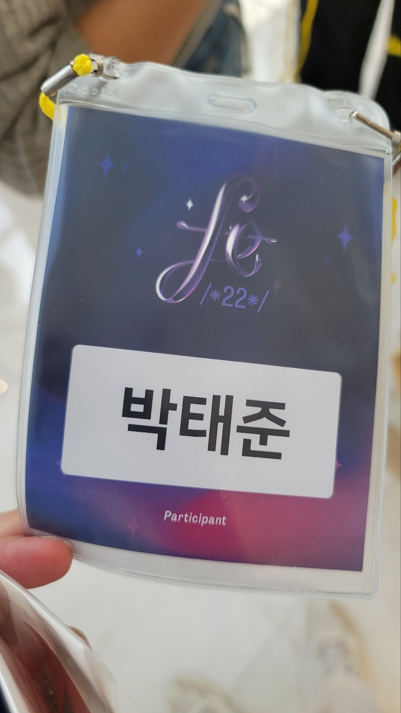
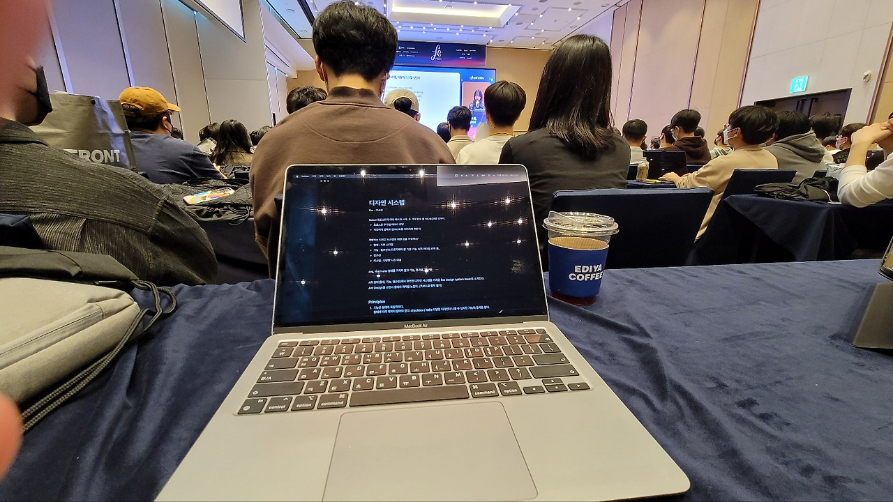

|  |  |
| ---------------------------------------- | ----------------------------------------- |

2022.10.8(토) 잠실 롯데타워 31층에서 열린 FEConf 2022에 다녀왔다.

장소는 2개의 강연장(Track A, Track B)과 강연장으로 가기 전 FEConf를 후원한 기업들 부스가 있는 홀로 구성되어 있었다. 각 기업 부스들에서 간단한 설문, 이벤트를 참여하면 굿즈나 운이 좋으면 키보드, 에어팟 맥스 같은 것을 받을 수 있었다. FEConf 자체에서도 다 끝나고 에어팟, 아이패드, 아이패드 에어를 추첨하기도 했다.

기술 트렌드에 관심 있어서 왔지만 이런 이벤트 진행들과 함께 활기 넘치는 분위기여서 더 재밌었다. 채용 혹은 이직을 희망하는 사람들을 대상으로 채용상담할 수 있는 기회가 있는 것도 좋아 보였다. 몇몇 회사는 간편 전형이라고 서류전형을 패스하는 회사들도 있었다. 예전에 설계할 때 이런 채용 부스에서 상담을 통해 채용된 적이 있어서 나는 이런 기회를 상당히 긍정적으로 생각한다. 내가 인사 면접관이어도 이런 곳에 참가할 열정을 가진 청년들을 뽑고 싶어 할 것 같다. 심지어 300명 제한이었으니 정말 이런 기술에 관심이 있는 사람들만 왔을 것이니 말이다.

13:00부터 섹션이 시작되어야 하지만, 기술적인 문제로 30분씩 뒤로 밀려서 13:00에 후원기업들을 소개하고 13:30분쯤부터 예정되어 있던 섹션이 시작되었다. 참고로 나는 동료들과 30분 전쯤 입장해서 거의 맨 뒤에라도 자리에 앉을 수 있었지만 섹션이 시작하기 직전에 도착한 사람들은 자리에 앉지 못하고 서서 들어야 했다. 각 섹션이 끝난 뒤에도 듣고 싶은 강연장으로 이동해야 했는데 워낙 사람이 많아 매번 이동하기 어려웠고 자리에 못 앉으면 타이핑을 할 수 없으니 이왕 자리 잡은 거 오프라인에서는 TrackB를 다 듣고 온라인으로 TrackA를 다 들어야겠다고 생각했다. 참고로 온라인으로는 [FEConf2022 유튜브](https://www.youtube.com/results?search_query=FEConf2022)에서 들을 수 있다.

이런 이유로 아래 후기들은 오프라인에서 들은 TrackB 섹션들을 대상으로 썼다.

## \[TrackB\] Design System, 형태를 넘어서

이소영님, flex

이소영님은 회사에서 사용하고 있는 디자인 시스템들이 어떻게 개선되어 현재까지 왔는지 보여주고 앞으로 어떤 방향으로 개선하고자 하는지 설명해주셨다. 실제 실무에서 쓰일 법한 컴포넌트 예시를 통해 설명해주면서 코드까지 함께 있어서 더욱 이해하기 편했다. 흥미로웠던 것은 “개발자는 디자인 시스템에서 어떤 것을 기대하나?”의 주제에서 4가지 항목을 도출시켜서 얘기를 해주셨던 것이었는데 형태, 기능, 접근성, 커스텀으로 나누어서 어떻게 컴포넌트를 설계하는 것이 좋은지 접근하는 방식이었다.

섹션을 요약하면 공통 컴포넌트로 사용하기 위해 예를 들면 버튼 컴포넌트 하나를 만들고 모든 것을 props로 내리는 방식, 매번 모든 것을 props로 내리면서 복잡성이 높아진 컴포넌트를 만들지 않기 위해 A버튼 컴포넌트, B버튼 컴포넌트 등 여러 커스텀 컴포넌트로 나눈 방식이 좋지 않다고 판단되어 최소한의 기본 동작만 정의해놓고 재사용성을 높인 Linear 디자인 시스템을 구축했다. 하지만, 시간이 지나고 보니 다양한 상황을 매번 정의해야 하는 불편함이 생겼고 이로 인해 조합에 대한 피로도가 증가하게 되었다. 그래서 Linear-Extension이란 명칭을 부여하고 재사용성이 높은 기본 기능을 위한 컴포넌트도 존재하고 특정 목적을 가진 컴포넌트도 존재하는 시스템으로 발전하게 되었다고 한다.

> **추천하는 사람**  
> 나 같이 아직도 컴포넌트 설계에 대해 목마름을 가지고 있는 사람은 들어보면 좋을 인사이트를 얻을 수 있을 것이다

> **+**  
> 현재 재직 중인 회사에서도 hr관련된 서비스를 개발하고 있다. 며칠 전에 신분당선 지하철에서 hr관련 서비스인 flex광고를 보고 궁금해서 flex회사 블로그를 들어가 봤었는데, 개발 문화가 좋은 곳 같았다. 우연하게 찾아본 지 얼마 안 된 회사에서 강연을 하고 있는 것이 너무 신기했다.

## \[TrackB\] 일백개 패키지 모노레포 우아하게 운영하기

오창영님, 토스

해당 섹션은 왜 모노레포를 사용해야 하는지, 모노레포의 특징은 무엇인지, 기존 npm과 yarn classic의 의존성 관리에 대한 문제점 등 원론적인 얘기들이 주를 이루는 섹션이었다. 아직 모노레포를 직접 구축해본 적은 없다 보니 와닿지 않아서 더 원론적인 섹션으로 느껴졌을 수도 있었을 것이다. 나도 언젠간 모노레포를 직접 구축할 날이 올 것이고 오창영님이 발표해주신 내용처럼 사내에서도 쓰면서 오픈소스로도 모노레포 라이브러리를 배포할 수 있는 날이 오면 좋겠다는 생각을 했다.

> **+**  
> 현재 재직중인 회사에서 2가지를 최근에 느꼈었고, 모노레포에 대해 알아보게 된 계기가 되었었다.  
> \- 많은 레거시 프로젝트들을 관리하면서 느낀 점은 모두 개발 환경이 다름에 따라 개발 경험이 다 달라서 불편하다는 것이었다. 마지막 관리한 지 몇 년 된 프로젝트의 경우에는 동작을 하고 있는지 조차도 의심스러웠다.  
> \- 신규 프로젝트를 진행할 때 동시에 여러 프로젝트들이 진행되다보니 매번 환경을 세팅해야 했고, 공통으로 사용하는 컴포넌트들을 매번 복사 붙여넣기 해야 하는 불편함을 보았다.

## \[TrackB\] UX 개발자, 대형 서비스 빠르게 프로토타입하기

박신연님, 구글 검색

우리는 프로토타입이 무엇인지 알고 있다. 실제 서비스로 만들어보기 전에 빠른 시간내에 만들어 보는 것을 말한다. 만약, 이 섹션에서 프로토타입의 개념적인 이야기가 주를 이루었다면 자칫 지루할 수 있었지만, 구글 UX팀에서 근무하면서 경험한 내용들을 주로 풀어주시면서 이해보다는 공감을 유도하는 방식이 흥미를 이끌었다. 특히, 후반부에 개발 프로토 타입 부분 - 실제 환경 파트가 인상 깊었다.

- 목업 환경  
  테스트하려는 컴포넌트만 집중해서 만들고 나머지 UI들은 실제로는 각종 컴포넌트가 섞여 있는 것이지만 1장의 이미지로 대체하여 테스트 하려는 환경을 빠르게 구축한다.
- 컴포넌트 환경  
  실제 컴포넌트들을 간소화해서 간단하게 만들어서 테스트한다.
- 실제 환경  
  매번 컴포넌트들을 만들기에는 서비스가 너무 방대하다보니 전체 디자인이 바뀌고 그랬을 때 구글 익스텐션으로 DOM이나 CSSOM을 수정하게 한다. 이렇게 제어 했을 때 좋은 점은 페이지 이동 시에도 유지된다고 한다. 그런데 문제도 있다. 만들어놓고 만약 DOM의 Selector가 변경되면 크롬 익스텐션을 다시 수정해야 한다.

> **+**  
> 실제로 방대한 UI가 수정되어야 하는 이슈의 경우 한번 이 방법을 이용해보면 굉장히 좋을 것 같다. 기획 및 QA팀과 소통할 때 특히 장점을 발휘할 수 있을 것 같다.

## \[TrackB\] 내 IMPORT문이 그렇게 이상했나요?

박서진님, 토스

script문으로 불러오고있는 모듈들은 사용하지 않는 부분들까지 다 로드해오는 문제가 있다. 하지만, 레거시 프로젝트들을 보면 이렇게 불러오고 있는 script문이 굉장히 많은 것을 볼 수 있다. CommonJS방식은 이런 문제점을 벗어나 원하는 함수만 불러올 수 있게끔 하였다. 현재 언어차원에서 ESM을 지원하고 있지 않다면 ESM방식을 사용했을 때 Babel을 돌려보면 CommonJS방식으로 변환되는 것을 볼 수 있다는 것을 알게 되었다.

박서진님 발표에서는 CommonJS방식과 ESM방식에 대한 차이점을 이해하기 쉽게 설명해주시면서 일목요연하게 필요한 것들만 매끄럽게 설명해주셨다. 인상깊었던 점은 CommonJS방식에서 ESM방식으로 옮기는 방법과 옮길 때 겪는 난관에 대해 설명해주시고 적용해보기 위해서는 이런 환경일 때 권유한다는 점까지 공유해주셨다. 훗날, 많은 라이브러리들이 ESModule방식을 지원할 때 통일성있게 바꿔보면 좋을 것 같다.(과연 그런날이 올까라는 의문점도 동시에 든다.)

> **+**  
> 현재 재직중인 회사에서 레거시 프로젝트들을 관리할 때 CommonJS방식, AMD방식으로 되어있는 모듈관리들을 봤었다. 대략적으로 이런방식이 있다고는 알고 있었지만 무슨 장점이 있을까 싶었다. 오늘 CommonJS방식에 대해 추가적으로 알게된 것들이 있었는데 동기적으로 불러오고 사용할데가 아니면 불러오지 않는다고 한다.

## \[TrackB\] 상태관리 이 전쟁을 끝내러 왔다.

최수형님, 메카테라

Redux는 점점 도태되는 기술로 평가받고 있다. 과거의 jQuery처럼..

최수형님은 OOP방식으로 직접 상태관리 할 수 있다는 것을 라이브 코딩으로 보여주셨다. 예제는 [이곳](https://github.com/megaptera-kr/micro-store-tdd-feconf2022)에서 볼 수 있다.  
리액트에서 제공하는 useSyncExternalStore를 이용해서 만드는데 많은 개발자 앞에서 실시간으로 코드도 치고 디버깅도 하시는 모습이 인상 깊었다. 그 중에서도 가장 인상 깊었던 것은 테스트 코드를 미리치고 리팩토링을 실시간으로 하는 것이었는데, 테스트 코드가 있기 때문에 마음껏 리팩토링을 할 수 있더라!

## 종합적으로 느낀점

### \# 1

다른 개발자분들의 뜨거운 열정을 느낄 수 있었고 몇 가지는 빠른 시일내에 꼭 도전해보고 싶은 것들이 생겼다.

- flex사의 Linear-extension방식으로 Component예제보고 학습한 뒤 해당 방법으로 여러 컴포넌트 개발해보기
- 모노레포 만들어보기
- 크롬 익스텐션 개발 : 나에게 필요한 것부터 만들어보면 좋을 것 같다.
- 테스트 코드 작성

10월에는 회사에서 줄 야근이 예정되어 있기 때문에 Linear-extension방식의 컴포넌트 개발 방법을 공부해보고 나머지 시간에 테스트 코드를 먼저 공부해야 겠다.

### \# 2

그린랩스에 재직중인 동료로 인해 알게되었던 Rescript에 대해 자세하게 들어보고 싶어서 TrackA의 그린랩스 정미량님이 소개해주신 ReScript 섹션을 꼭 들어볼 것이다. 이외에도 네이버 노용구님이 소개해주신 텍스트 에디터, 당근마켓 김혜성님이 속해주신 Edge Computing으로 프론트엔드 포텐셜 끌어올리기도 꼭 봐야겠다.
