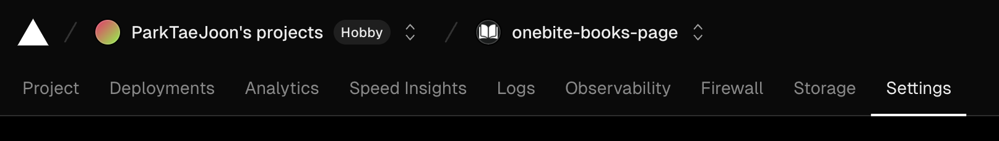
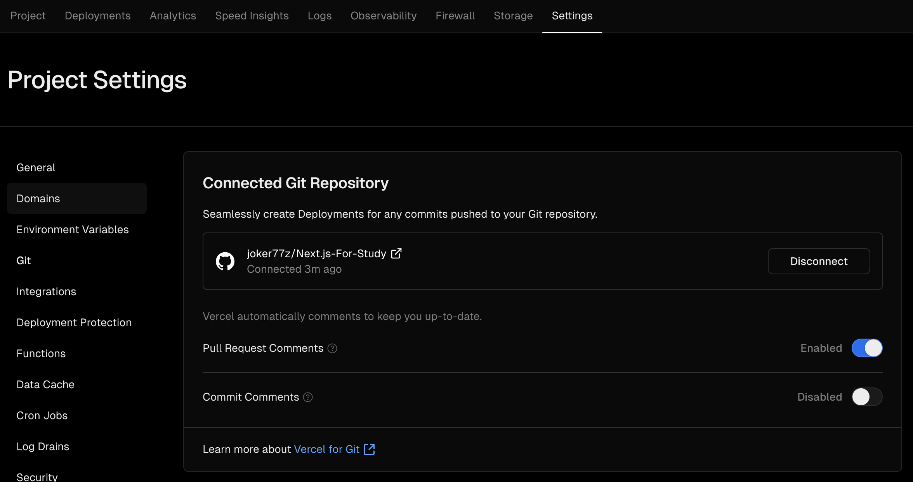

## Automatic 배포

레포에 소스를 Push만 하면 Vercel에서 바로 배포까지 자동으로 해주는 방법입니다.

1. 각 프로젝트에서 Settings로 진입합니다.

2. 좌측에 Git으로 들어가서 `Connected Git Repository`에 내 깃헙 레포를 연결만 하면 끝!

   

> 주의 : 만약, 연결시킨 레포 루트에 package.json이 없다면 Settings > General > Root Directory 에서 package.json이 있는 폴더 위치로 변경해주면 됩니다.